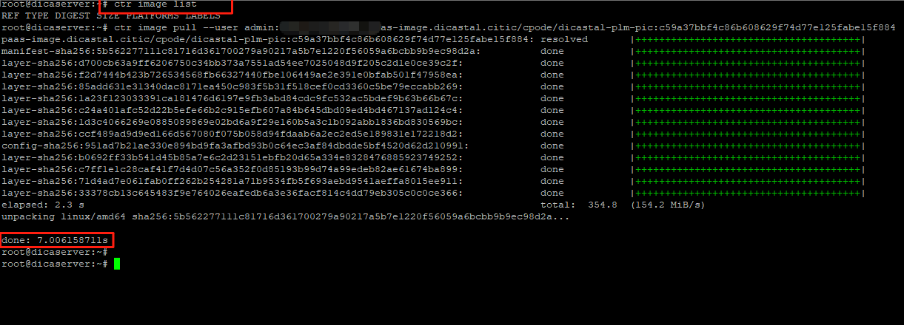
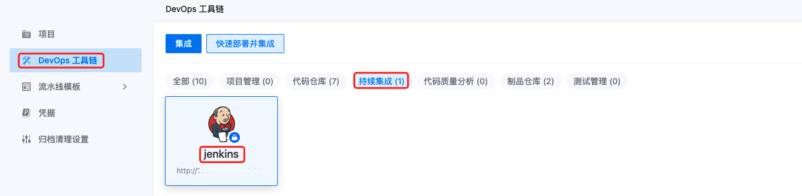
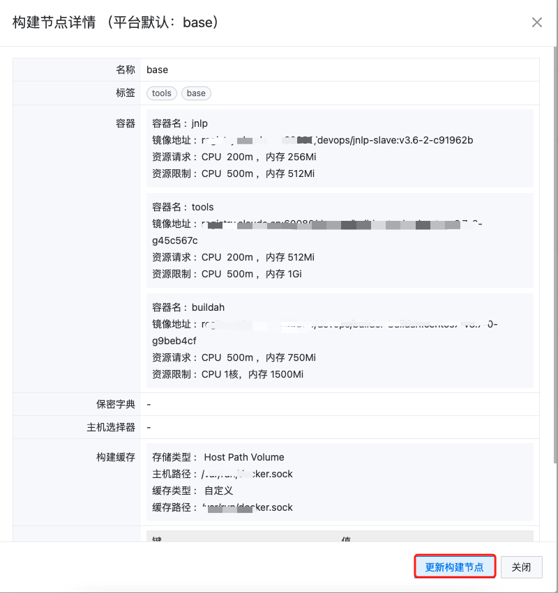
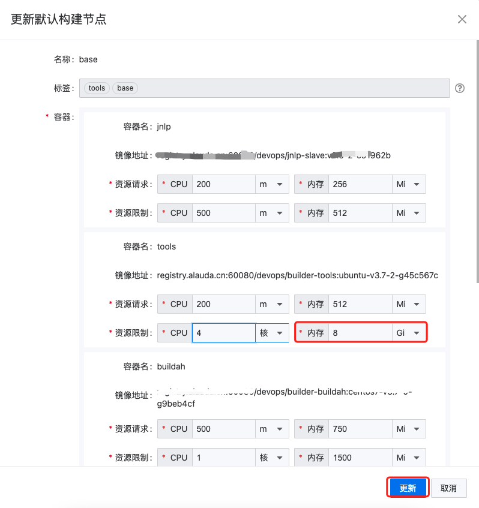

---
kind:
  - Troubleshooting
products:
  - Alauda Container Platform
  - Alauda DevOps
  - Alauda AI
  - Alauda Application Services
  - Alauda Service Mesh
  - Alauda Developer Portal
ProductsVersion:
  - 4.1.0,4.2.x
---
<!-- A type of document that involves encountering a fault, diagnosing it, performing root cause analysis, and providing solutions. -->

# 扫描大型仓库出现 oom

Java heap space Cannot allocate memory

## Cause
- 内存资源分配不足

## Resolution
- 增加base节点tools容器的内存限制
- 增加base节点jnlp容器的内存限制

## [workaround]

## [Related Information]
**Screenshots**

5. 在**DevOps工具链**集成列表找到对应的**Jenkins实例。** ****

- Environment: 3.6, 3.7
- base节点
- tools容器
- jnlp容器
- Jenkins实例
- Sonar扫描
- Component: jenkins
- Page ID: 101662832
- Original Title: 扫描大型仓库出现 oom
