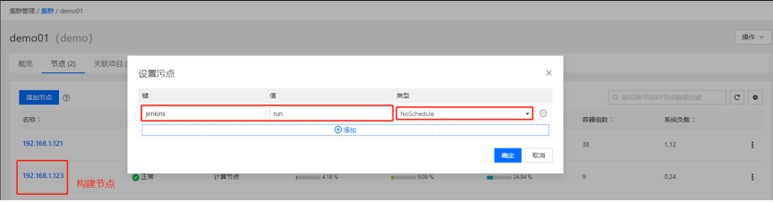
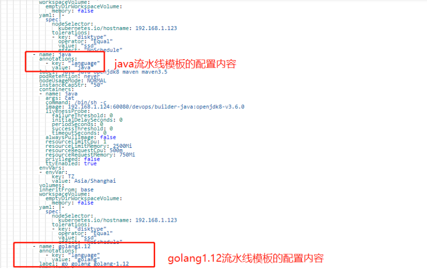
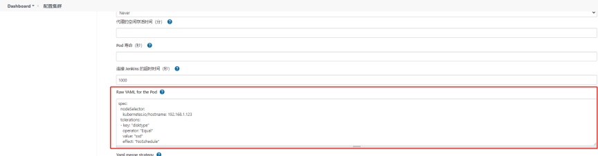
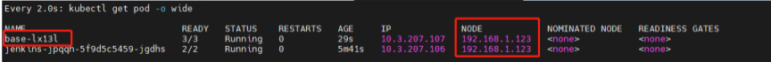

---
kind:
  - Troubleshooting
products:
  - Alauda Container Platform
  - Alauda DevOps
  - Alauda AI
  - Alauda Application Services
  - Alauda Service Mesh
  - Alauda Developer Portal
ProductsVersion:
  - 4.1.0,4.2.x
---
<!-- A type of document that involves encountering a fault, diagnosing it, performing root cause analysis, and providing solutions. -->

# 3.8.1

构建速度慢，偶现性构建失败 jenkins slave无法被正常调度

## Cause
- 默认resource资源限制导致性能问题
- 业务Pod占用构建节点资源

## Resolution
- 在构建机添加污点jenkins-slave=true:NoSchedule
- 修改mount结尾的ConfigMap添加nodeSelector和tolerations
- 重启jenkins服务或删除jenkins pod
- 通过Raw YAML for the Pod验证配置生效

## [workaround]

## [Related Information]
**Screenshots**

- Environment: TKE 3.8.1
- jenkins.yaml
- mount结尾的ConfigMap
- spec.nodeSelector.jenkins-slave
- spec.tolerations
- /var/run/docker.sock
- http://jenkins/restart
- Component: jenkins
- Page ID: 123605032
- Original Title: 3.8.1-jenkins slave添加容忍方式
