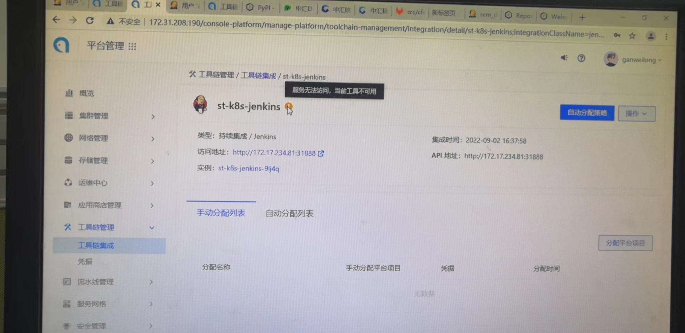
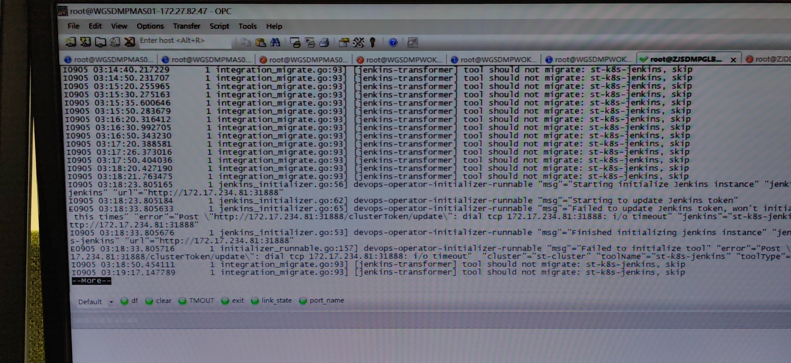

---
kind:
  - Troubleshooting
products:
  - Alauda Container Platform
  - Alauda DevOps
  - Alauda AI
  - Alauda Application Services
  - Alauda Service Mesh
  - Alauda Developer Portal
ProductsVersion:
  - 4.1.0,4.2.x
---
<!-- A type of document that involves encountering a fault, diagnosing it, performing root cause analysis, and providing solutions. -->

# 3.8

平台对接Jenkins显示感叹号 分配项目时报凭据认证失败

## Cause
- Jenkins网络策略限制导致global地址无法访问

## Resolution
- 开通对应Jenkins网络策略

## [workaround]

## [Related Information]
**Screenshots**
3.8版本，平台在工具链那对接jenkins服务，jenkins服务直接访问正常，平台对接感叹号，且分配项目时报凭据认证失败
2、查询devops-controller日志发现global连接jenkins访问地址不通
- Environment: 3.8
- devops-controller
- Jenkins
- global连接地址
- 网络策略配置
- Component: jenkins
- Page ID: 127409178
- Original Title: 3.8-DevOps-集成jenkins工具链异常
