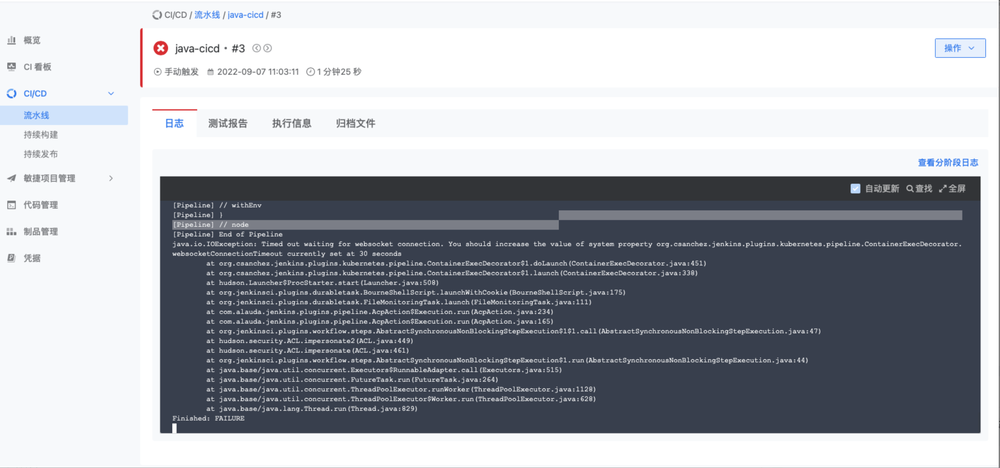

---
kind:
  - Troubleshooting
products:
  - Alauda Container Platform
  - Alauda DevOps
  - Alauda AI
  - Alauda Application Services
  - Alauda Service Mesh
  - Alauda Developer Portal
ProductsVersion:
  - 4.1.0,4.2.x
---
<!-- A type of document that involves encountering a fault, diagnosing it, performing root cause analysis, and providing solutions. -->

# 流水线执行jenkins报错

websocketConnectionTimeout currently set at 30 seconds 流水线卡在clone阶段 修改websocket超时时间后报错变为Internel Error 500

## Cause
- NFS存储问题导致Jenkins部署不稳定

## Resolution
- 将Jenkins存储从NFS PVC切换为hostpath部署

## [workaround]
- 调整jenkins master的websocket超时时间：从30s改到240s

## [Related Information]
**Screenshots**

- Environment: TKE 3.9
- jenkins websocket配置
- nfs
- pvc
- hostpath
- etcd
- Component: jenkins
- Page ID: 130572023
- Original Title: 流水线执行jenkins报错
