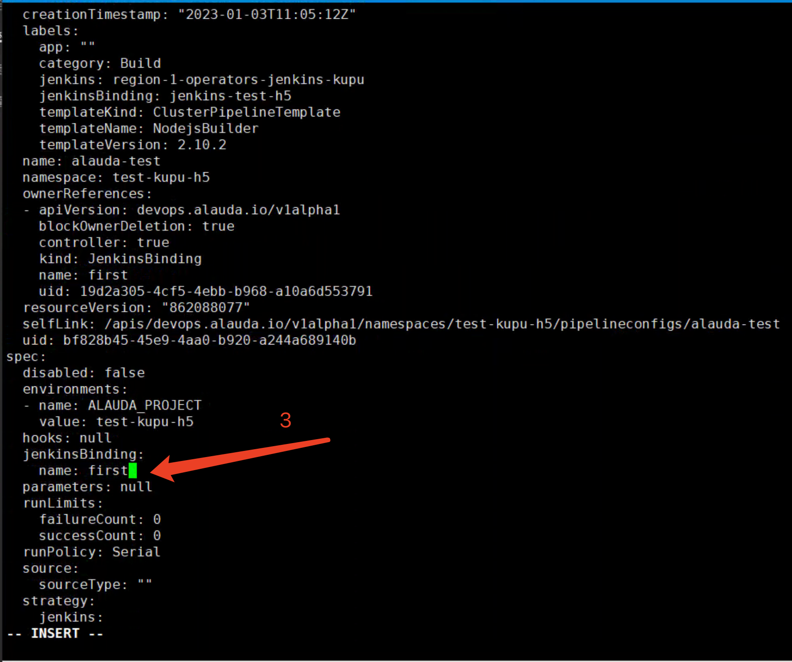

---
kind:
  - Troubleshooting
products:
  - Alauda Container Platform
  - Alauda DevOps
  - Alauda AI
  - Alauda Application Services
  - Alauda Service Mesh
  - Alauda Developer Portal
ProductsVersion:
  - 4.1.0,4.2.x
---
<!-- A type of document that involves encountering a fault, diagnosing it, performing root cause analysis, and providing solutions. -->

# 3.0

前端无法修改jenkins执行实例

## Cause

## Resolution
- 在新jenkins实例页面绑定项目
- 执行命令获取流水线配置yaml: kubectl get pipelineconfig -n test-kupu-h5 alauda-test -o yaml > alauda-test.yaml
- 执行update_jkb.sh脚本修改yaml并更新: bash update_jkb.sh test-kupu-h5 first alauda-test.yaml
- 页面确认修改结果并测试流水线执行

## [workaround]

## [Related Information]
**Screenshots**

- Environment: TKE 3.0 至 TKE 3.10
- kubectl get pipelineconfig
- yq(4.18+)
- jkb资源
- pipelineconfig资源
- metadata.ownerReferences
- spec.jenkinsBinding.name
- Component: jenkins
- Page ID: 133093597
- Original Title: 3.0-修改流水线jenkins执行实例
