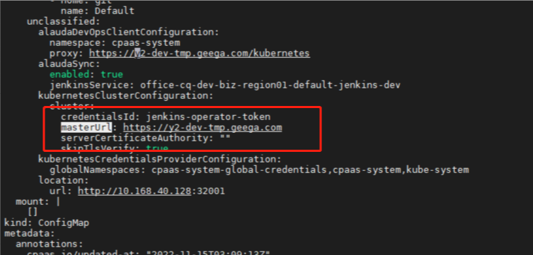

---
kind:
  - Troubleshooting
products:
  - Alauda Container Platform
  - Alauda DevOps
  - Alauda AI
  - Alauda Application Services
  - Alauda Service Mesh
  - Alauda Developer Portal
ProductsVersion:
  - 4.1.0,4.2.x
---
<!-- A type of document that involves encountering a fault, diagnosing it, performing root cause analysis, and providing solutions. -->

# jenkins修改kubernetes url被还原

通过 jenkins 系统设置页面修改 kubernetes url 被还原

## Cause
- 直接修改 jenkins 页面配置未持久化到底层存储

## Resolution
- 修改 jenkins-mount-xxxxx 名称的 configmap 对应字段

## [workaround]

## [Related Information]
**Screenshots**

- Environment: TKE 3.6.2
- jenkins-mount-xxxxx configmap
- Component: jenkins
- Page ID: 136533305
- Original Title: jenkins修改kubernetes url被还原
