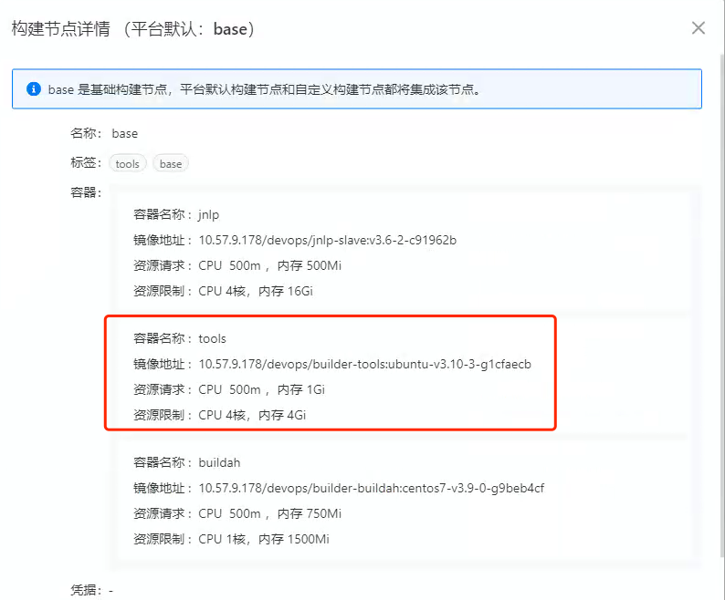
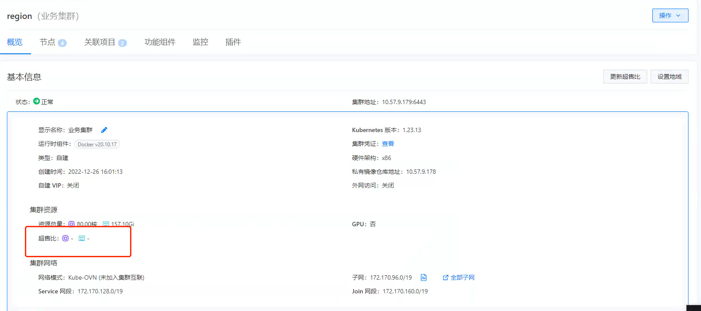
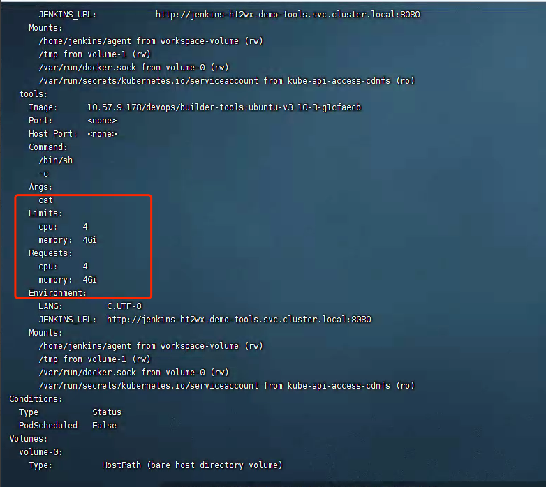

---
kind:
  - Troubleshooting
products:
  - Alauda Container Platform
  - Alauda DevOps
  - Alauda AI
  - Alauda Application Services
  - Alauda Service Mesh
  - Alauda Developer Portal
ProductsVersion:
  - 4.1.0,4.2.x
---
<!-- A type of document that involves encountering a fault, diagnosing it, performing root cause analysis, and providing solutions. -->

# 业务集群存在默认超售比导致修改资源限制失效

修改资源限制后Pod未生效，Deploy/ReplicaSet已生效

## Cause
- 默认超售比错误应用到所有namespace（包括平台外namespace）

## Resolution
- 升级到TKE 3.12版本修复
- 临时方案：在业务集群打开超售比后立即关闭

## [workaround]
- 在业务集群界面执行超售比开关操作

## [Related Information]
**Screenshots**

- Environment: TKE 3.10/TKE 3.11
- namespace
- 超售比配置
- Deployment
- ReplicaSet
- Pod资源限制
- Component: jenkins
- Page ID: 140807237
- Original Title: 业务集群存在默认超售比导致修改资源限制失效
