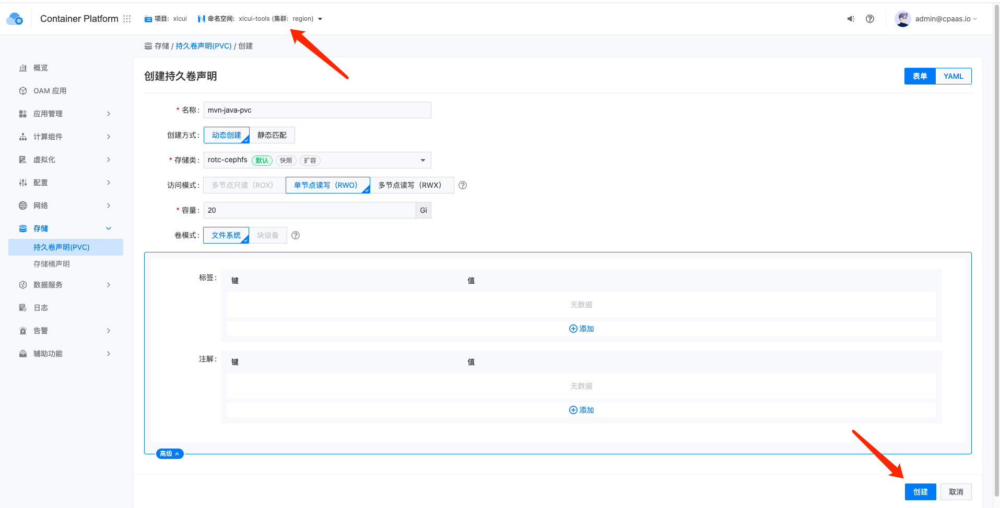
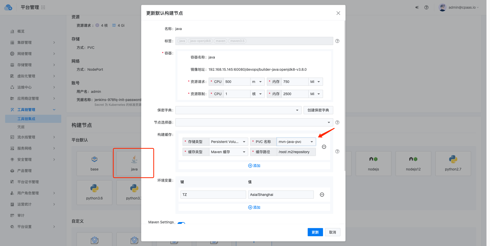
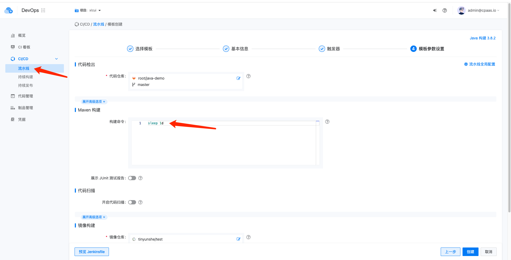
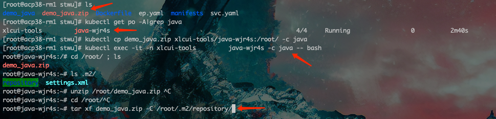
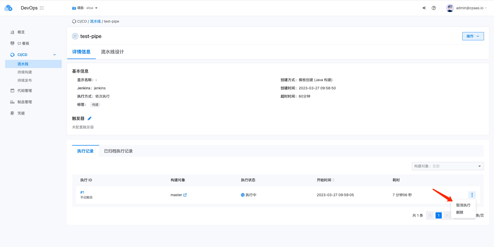

---
kind:
  - Troubleshooting
products:
  - Alauda Container Platform
  - Alauda DevOps
  - Alauda AI
  - Alauda Application Services
  - Alauda Service Mesh
  - Alauda Developer Portal
ProductsVersion:
  - 4.1.0,4.2.x
---
<!-- A type of document that involves encountering a fault, diagnosing it, performing root cause analysis, and providing solutions. -->

# 将本地打包缓存拷贝到jenkins slave pvc方法

## 环境信息 适用版本：TKE 3.4以上

## Cause

## Resolution
- 在jenkins所在名称空间创建java使用的PVC
- 在工具链集成选择jenkins实例，更新java构建节点页面添加构建缓存并选择PVC
- 创建临时流水线将maven构建命令改为sleep 1d保持pod运行
- 打包本地repository目录为demo_java.zip
- 获取java pod名称后执行：kubectl cp将数据拷贝到容器/root目录
- 通过kubectl exec进入容器解压到/root/.m2/repository
- 取消临时流水线执行
- 确认settings.xml中Local Repository路径为/root/.m2/repository

## [workaround]

## [Related Information]
**Screenshots**

- Environment: TKE 3.4以上
- pvc
- jenkins
- java构建节点
- /root/.m2/repository
- settings.xml
- Component: jenkins
- Page ID: 140822621
- Original Title: 将本地打包缓存拷贝到jenkins slave pvc方法
