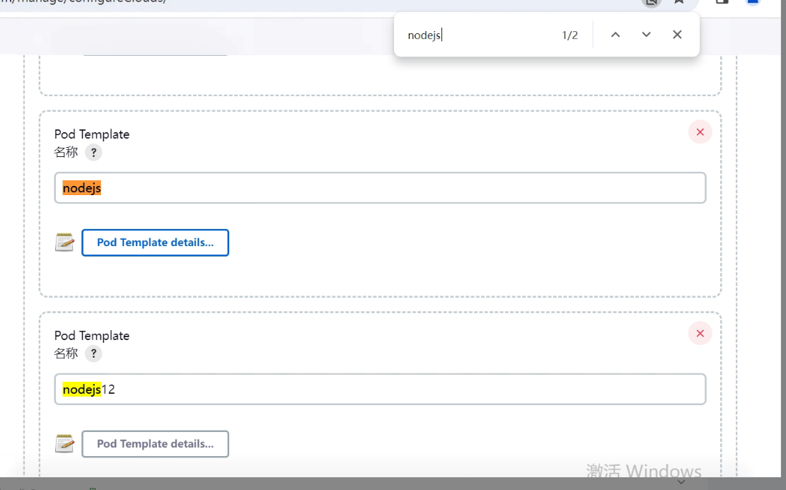
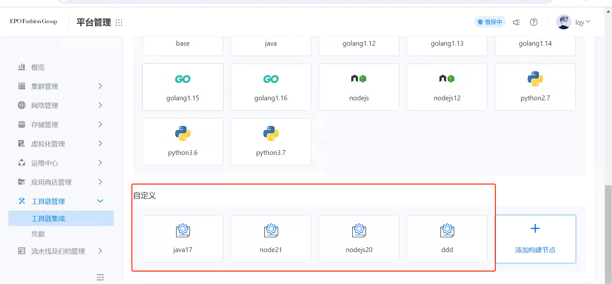
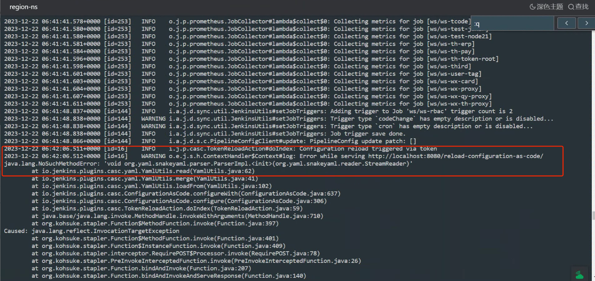
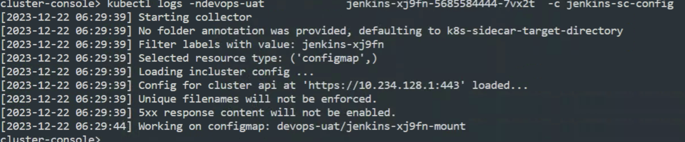
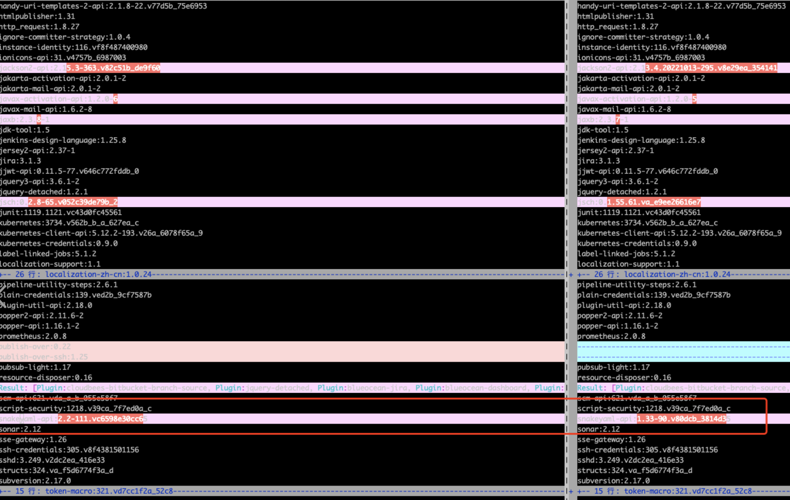

---
kind:
  - Troubleshooting
products:
  - Alauda Container Platform
  - Alauda DevOps
  - Alauda AI
  - Alauda Application Services
  - Alauda Service Mesh
  - Alauda Developer Portal
ProductsVersion:
  - 4.1.0,4.2.x
---
<!-- A type of document that involves encountering a fault, diagnosing it, performing root cause analysis, and providing solutions. -->

# 构建节点配置无法同步到jenkins

构建节点配置无法同步到Jenkins Jenkins日志中报错关于响应reload-config接口的报错 jenkins-sc-config未正常运行

## Cause
- 用户自行安装Publish over ssh插件导致snakeYaml插件版本过高

## Resolution
- 备份故障Jenkins数据目录
- 删除$JENKINS_HOME/plugin/*
- 从正常Jenkins拷贝plugin目录到故障实例
- 重启Jenkins

## [workaround]

## [Related Information]
**Screenshots**

- Environment: 通用
- jenkins-sc-config
- snakeYaml插件
- Publish over ssh插件
- reload-config接口
- Component: jenkins
- Page ID: 179602958
- Original Title: 构建节点配置无法同步到jenkins
