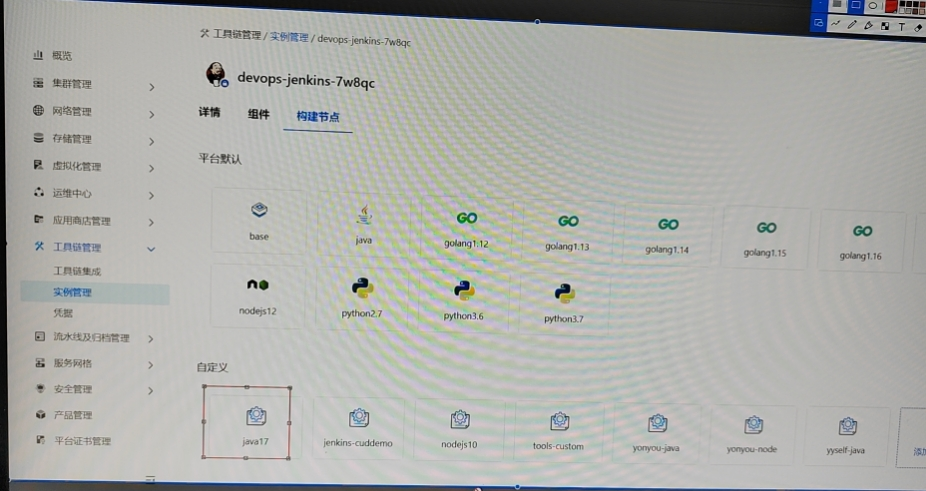
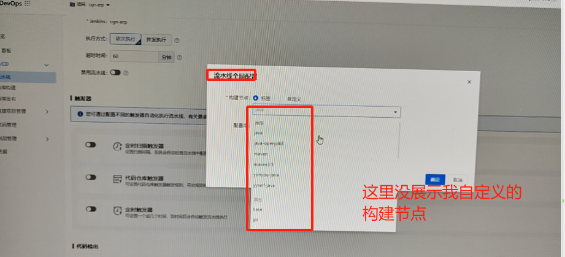

---
kind:
  - Troubleshooting
products:
  - Alauda Container Platform
  - Alauda DevOps
  - Alauda AI
  - Alauda Application Services
  - Alauda Service Mesh
  - Alauda Developer Portal
ProductsVersion:
  - 4.1.0,4.2.x
---
<!-- A type of document that involves encountering a fault, diagnosing it, performing root cause analysis, and providing solutions. -->

# devops 在jenkins自定义构建节点无效

jenkins创建自定义构建节点在流水线配置无法选择到 旧的jenkins添加完构建节点后页面上无法选到但jenkins UI中存在该节点

## Cause
- devops相关组件阻塞了jenkins事件

## Resolution
- 重启devops组件

## [workaround]

## [Related Information]
**Screenshots**

- Environment: 3.14.1
- jenkins构建节点配置
- devops组件
- Component: jenkins
- Page ID: 229837077
- Original Title: Devops-devops 在jenkins自定义构建节点无效
