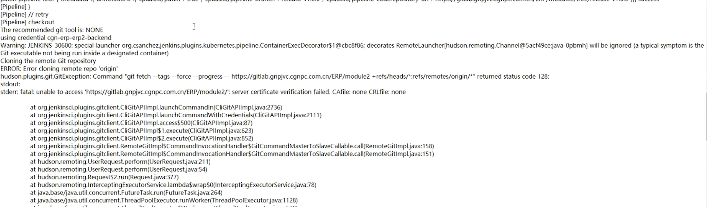
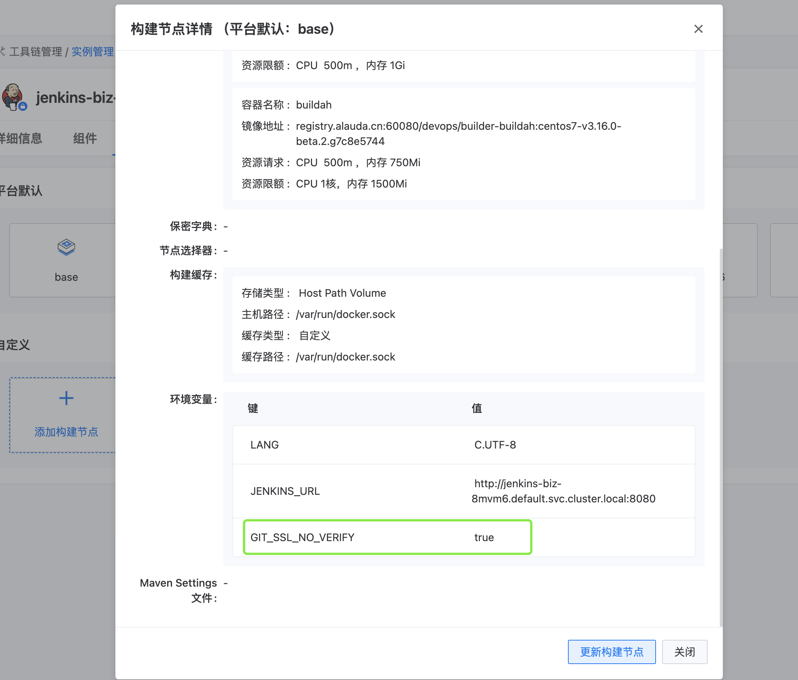
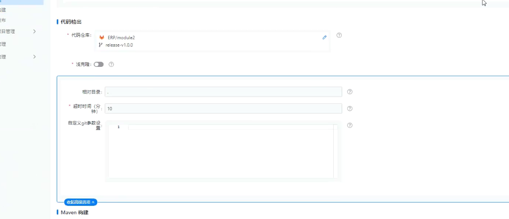

---
kind:
  - Troubleshooting
products:
  - Alauda Container Platform
  - Alauda DevOps
  - Alauda AI
  - Alauda Application Services
  - Alauda Service Mesh
  - Alauda Developer Portal
ProductsVersion:
  - 4.1.0,4.2.x
---
<!-- A type of document that involves encountering a fault, diagnosing it, performing root cause analysis, and providing solutions. -->

# clone阶段跳过ssl认证

server certificate verification failed CAfile none CRLfile none

## Cause
- gitlab使用https自签或非法证书导致ssl验证失败

## Resolution
- 在构建节点base pod中设置环境变量GIT_SSL_NO_VERIFY=true
- 重启jenkins服务
- 在流水线clone阶段添加git参数：git config --global http.sslVerify "false"

## [workaround]

## [Related Information]
**Screenshots**

- Environment: 3.x
- GIT_SSL_NO_VERIFY
- http.sslVerify
- jenkins
- base pod
- Component: jenkins
- Page ID: 229837167
- Original Title: Devops-clone阶段跳过ssl认证
