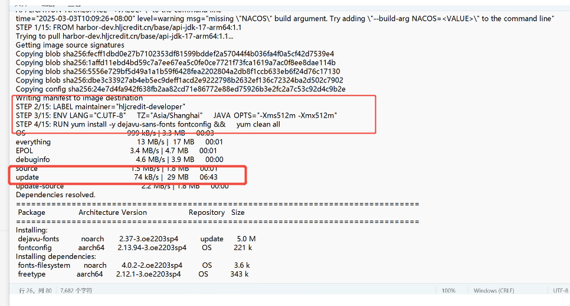
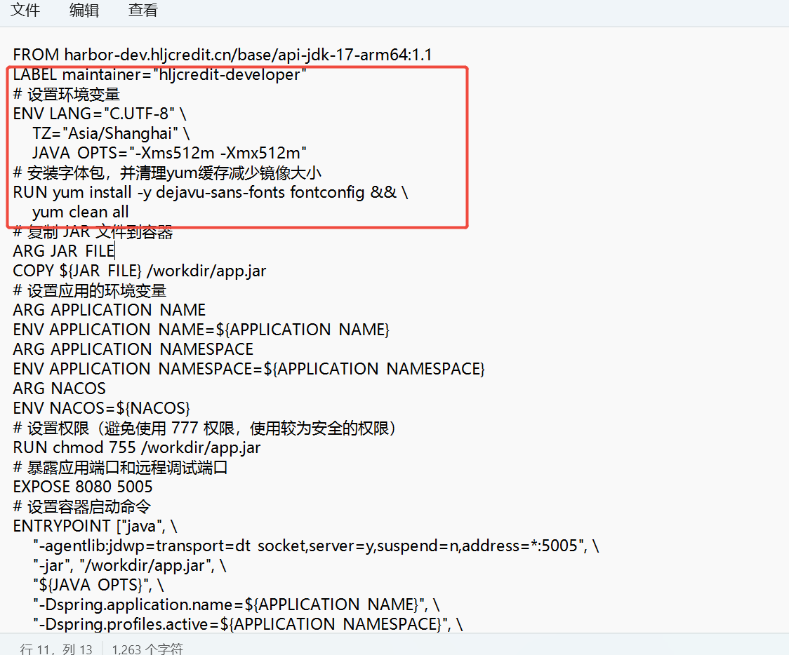

---kind:   - Troubleshootingproducts:    - Alauda Container Platform   - Alauda DevOps   - Alauda AI   - Alauda Application Services   - Alauda Service Mesh   - Alauda Developer PortalProductsVersion:   - 4.1.0,4.2.x---<!-- A type of document that involves encountering a fault, diag...it, performing root cause analysis, and providing solutions. --># jenkins构建超时 页面有报错jenkins构建超时 页面报错-101839 image-build清理update包耗时较多## Cause- update卸载包步骤执行时间过长## Resolution- 将Dockerfile中红框标注的步骤前置到基础镜像构建阶段- 创建新基础镜像(如newimage:v1)- 调整流水线Dockerfile使用新基础镜像- 删除原Dockerfile中重复的清理步骤## [workaround]- 重启jenkins服务- 重新配置凭证## [Related Information]**Screenshots**- Environment: 3.18.1- Dockerfile- 基础镜像- image-build步骤- 凭证配置- Component: jenkins- Page ID: 268534209- Original Title: Devops-jenkins构建超时 页面有报错-101839