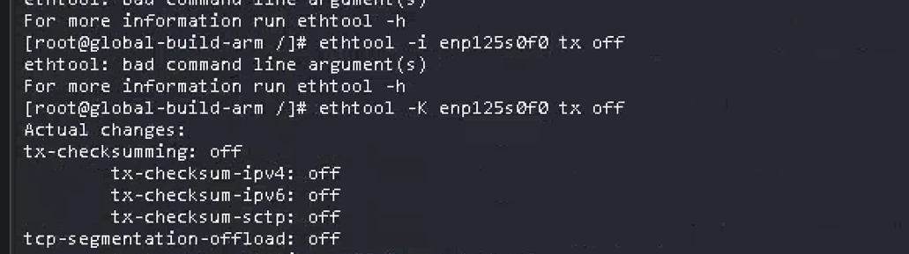
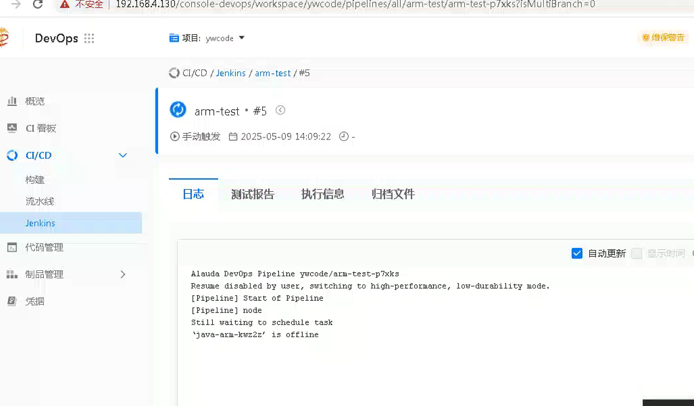
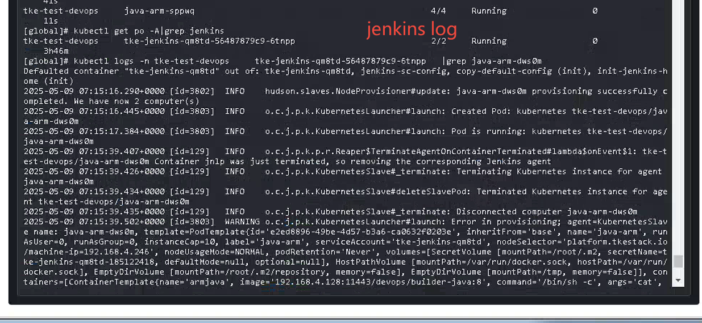
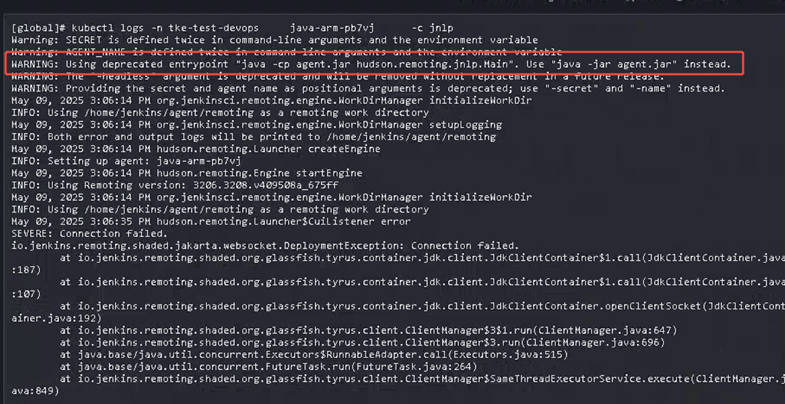
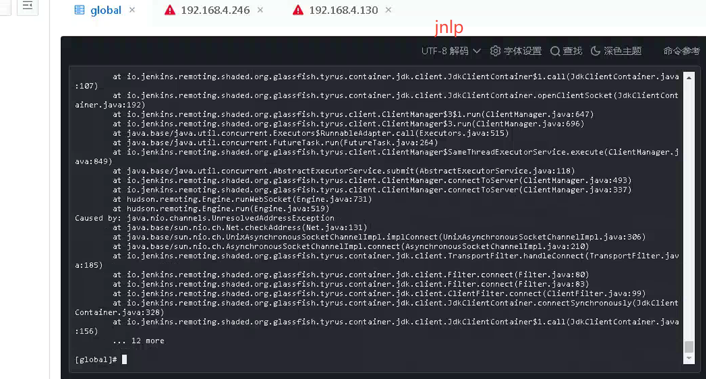

---
kind:
  - Troubleshooting
products:
  - Alauda Container Platform
  - Alauda DevOps
  - Alauda AI
  - Alauda Application Services
  - Alauda Service Mesh
  - Alauda Developer Portal
ProductsVersion:
  - 4.1.0,4.2.x
---
<!-- A type of document that involves encountering a fault, diagnosing it, performing root cause analysis, and providing solutions. -->

# 异构节点跑jenkins 流水线失败

在ARM架构节点上运行Jenkins流水线失败 已正确配置构建节点但执行仍失败

## Cause
- 流水线中仍存在与x86架构相关的依赖或配置

## Resolution
- 确保所有构建工具和依赖都有ARM架构版本
- 检查Jenkinsfile中是否有硬编码的架构相关配置
- 为ARM节点创建专用的构建环境配置
- 在流水线中添加架构检测逻辑

## [workaround]

## [Related Information]
**Screenshots**

- Environment: v3.16.2
- Jenkinsfile
- 构建工具
- ARM节点配置
- 架构检测逻辑
- Component: jenkins
- Page ID: 289112244
- Original Title: Devops-异构节点跑jenkins 流水线失败-107701-zh
