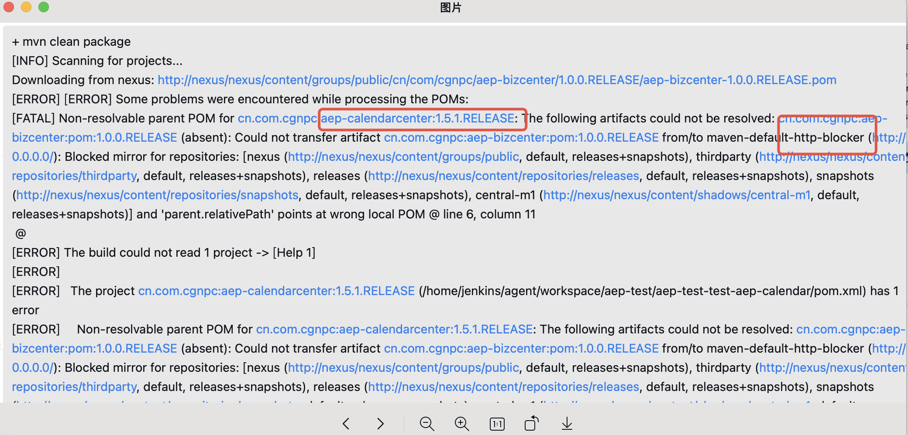

---
kind:
  - Troubleshooting
products:
  - Alauda Container Platform
  - Alauda DevOps
  - Alauda AI
  - Alauda Application Services
  - Alauda Service Mesh
  - Alauda Developer Portal
ProductsVersion:
  - 4.1.0,4.2.x
---
<!-- A type of document that involves encountering a fault, diagnosing it, performing root cause analysis, and providing solutions. -->

# maven构建报错maven

maven构建报错maven-default-http-blocker

## Cause
- 使用http协议的nexus仓库

## Resolution
- 配置java构建节点的settings.xml，添加指定mirror配置

## [workaround]

## [Related Information]
**Screenshots**

- Environment: 通用版本，使用HTTP协议的Nexus仓库
- settings.xml
- mirror
- maven-default-http-blocker
- mirrorOf
- blocked
- Component: jenkins
- Page ID: 345538852
- Original Title: Devops-maven构建报错maven-default-http-blocker
