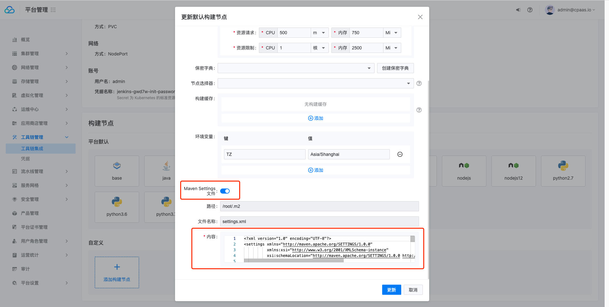
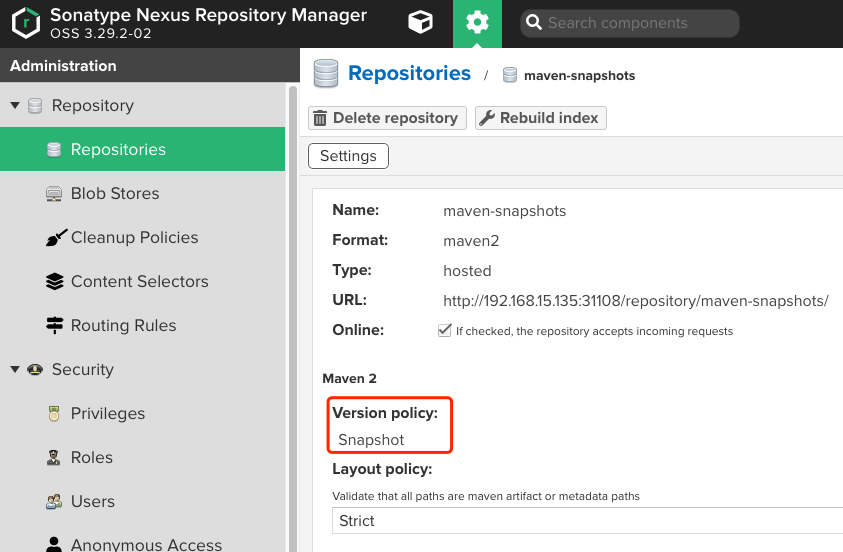
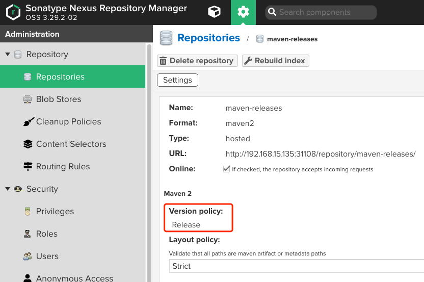

---
kind:
  - Troubleshooting
products:
  - Alauda Container Platform
  - Alauda DevOps
  - Alauda AI
  - Alauda Application Services
  - Alauda Service Mesh
  - Alauda Developer Portal
ProductsVersion:
  - 4.1.0,4.2.x
---
<!-- A type of document that involves encountering a fault, diagnosing it, performing root cause analysis, and providing solutions. -->

# 3.8.1

通过devops平台创建的java模板流水线无法配置nexus地址

## Cause
- 未正确配置settings.xml文件
- pom.xml未配置distributionManagement

## Resolution
- 配置settings.xml的servers/mirrors/profiles/activeProfiles四个部分
- 将settings.xml放置到java构建节点指定位置
- 在pom.xml中添加distributionManagement配置并指定release/snapshot仓库地址

## [workaround]

## [Related Information]
**Screenshots**

- Environment: TKE 3.8.1
- settings.xml
- pom.xml
- nexus-releases
- nexus-snapshots
- distributionManagement
- maven-public
- maven-releases
- maven-snapshots
- Component: nexus
- Page ID: 120102462
- Original Title: 3.8.1-maven配置nexus
