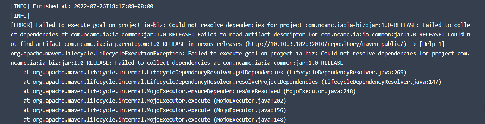

---
kind:
  - Troubleshooting
products:
  - Alauda Container Platform
  - Alauda DevOps
  - Alauda AI
  - Alauda Application Services
  - Alauda Service Mesh
  - Alauda Developer Portal
ProductsVersion:
  - 4.1.0,4.2.x
---
<!-- A type of document that involves encountering a fault, diagnosing it, performing root cause analysis, and providing solutions. -->

# mvn构建失败

cloud not find artifact com.ncamc.ia:ia-parent:pom:1.0-RELEASE in nexus-releases (http://xxxxxxx/repository/maven-public)

## Cause
- com.ncamc.ia:ia-parent:pom:1.0-RELEASE 依赖包未被推送到 nexus-release 仓库

## Resolution
- 将依赖包推送到 nexus-release 仓库
- 检查依赖项目的构建部署配置

## [workaround]

## [Related Information]
**Screenshots**

- Environment: 通用
- nexus-releases
- maven-public
- com.ncamc.ia:ia-parent
- 1.0-RELEASE
- Component: nexus
- Page ID: 120121994
- Original Title: mvn构建失败
