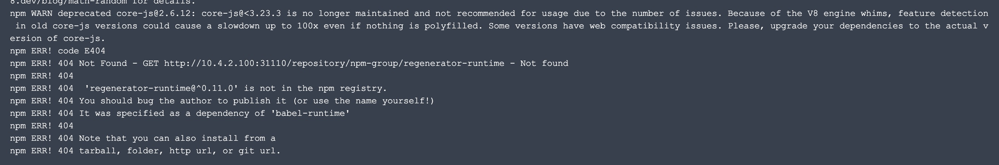

---
kind:
  - Troubleshooting
products:
  - Alauda Container Platform
  - Alauda DevOps
  - Alauda AI
  - Alauda Application Services
  - Alauda Service Mesh
  - Alauda Developer Portal
ProductsVersion:
  - 4.1.0,4.2.x
---
<!-- A type of document that involves encountering a fault, diagnosing it, performing root cause analysis, and providing solutions. -->

# npm打包报错404

npm打包时部分依赖下载不到报错404 调整代理源到taobao后问题依旧 手动补全缺失包后相继出现其他包缺失

## Cause
- 从nexus容器访问代理端时发生自动跳转
- 客户网络策略仅开放代理端地址未开放跳转地址

## Resolution
- 调整nexus到代理端跳转的网络策略

## [workaround]

## [Related Information]
**Screenshots**

- Environment: 通用
- nexus
- proxy代理配置
- 阿里云npm源
- Component: nexus
- Page ID: 124682986
- Original Title: npm打包报错404
