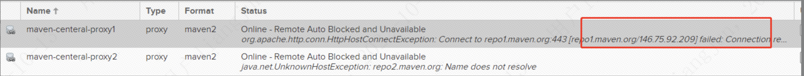

---
kind:
  - Troubleshooting
products:
  - Alauda Container Platform
  - Alauda DevOps
  - Alauda AI
  - Alauda Application Services
  - Alauda Service Mesh
  - Alauda Developer Portal
ProductsVersion:
  - 4.1.0,4.2.x
---
<!-- A type of document that involves encountering a fault, diagnosing it, performing root cause analysis, and providing solutions. -->

# nexus proxy库代理失败

nexus pod内wget/ping repo1.maven.org失败 nexus UI测试repo2.maven.org域名解析失败

## Cause
- 集群通向外网的网络转发异常
- 节点到repo1.maven.org/repo2.maven.org域名连通性异常

## Resolution
- 调整集群外网转发配置
- 修复节点到repo1.maven.org/repo2.maven.org的连通性

## [workaround]

## [Related Information]
**Screenshots**

- Environment: TKE 3.8
- maven-centeral-proxy1
- maven-centeral-proxy2
- repo1.maven.org
- repo2.maven.org
- Component: nexus
- Page ID: 130576952
- Original Title: nexus proxy库代理失败
