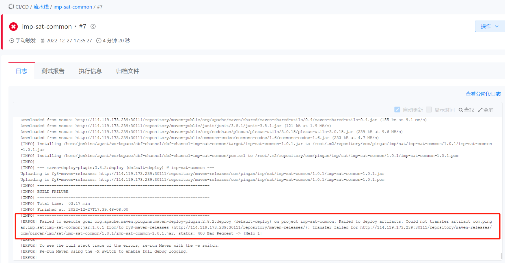
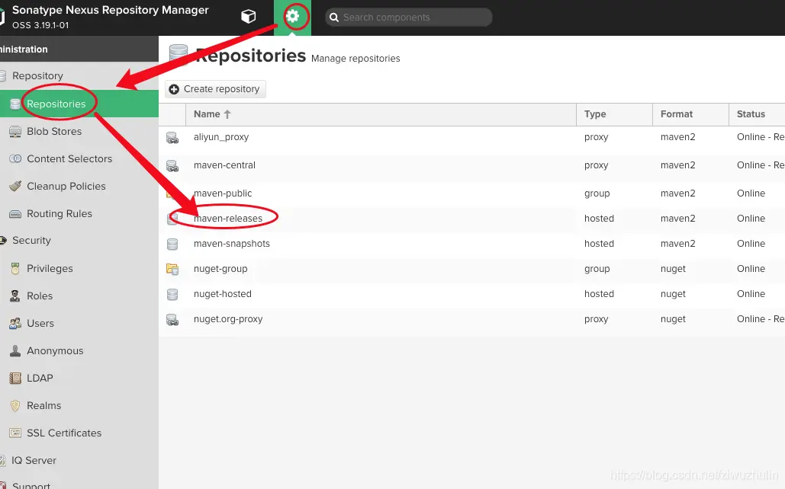
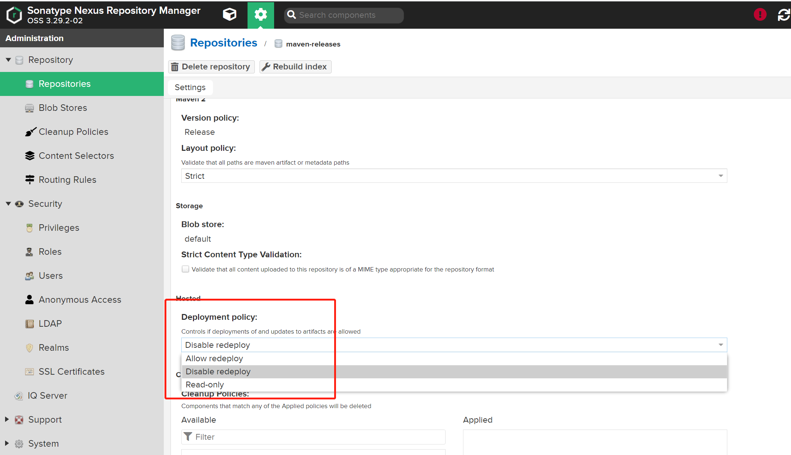

---
kind:
  - Troubleshooting
products:
  - Alauda Container Platform
  - Alauda DevOps
  - Alauda AI
  - Alauda Application Services
  - Alauda Service Mesh
  - Alauda Developer Portal
ProductsVersion:
  - 4.1.0,4.2.x
---
<!-- A type of document that involves encountering a fault, diagnosing it, performing root cause analysis, and providing solutions. -->

# nexus上传jar包失败

nexus上传jar包失败-报错400

## Cause
- releases仓库的部署策略默认为禁止部署

## Resolution
- 登录nexus界面检查对应仓库部署策略，修改为Allow Redeploy

## [workaround]

## [Related Information]
**Screenshots**

- Environment: Nexus通用版本
- releases仓库
- 部署策略配置
- Component: nexus
- Page ID: 133087280
- Original Title: nexus上传jar包失败-报错400
