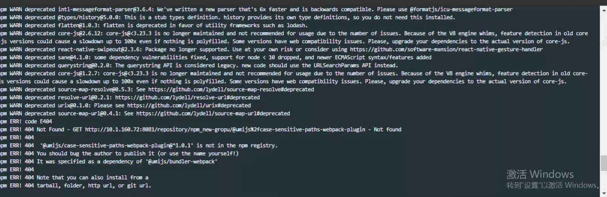

---
kind:
  - Troubleshooting
products:
  - Alauda Container Platform
  - Alauda DevOps
  - Alauda AI
  - Alauda Application Services
  - Alauda Service Mesh
  - Alauda Developer Portal
ProductsVersion:
  - 4.1.0,4.2.x
---
<!-- A type of document that involves encountering a fault, diagnosing it, performing root cause analysis, and providing solutions. -->

# nexus存储库故障

流水线执行node.js报错 npm_taobao-new代理库页面显示UnknowHost taobao.org错误 环境无法访问外网

## Cause
- nexus配置了混合库(npm_hosted + timeslinli_hosted + npm_taobao-new)
- 本地存储库缺少2fcase包(umijs目录)
- 代理库npm_taobao-new无法解析taobao.org域名

## Resolution
- 检查代理库网络连通性，确保nexus能解析taobao.org
- 更换可用的代理源（需环境具备外网访问能力）
- 确保所需包存在于正确的本地存储库中
- 调整私服配置指向正确的存储库

## [workaround]

## [Related Information]
**Screenshots**

- Environment: TKE 3.0
- npm_hosted
- timeslinli_hosted
- npm_taobao-new
- nexus混合库配置
- taobao.org
- UnknowHost错误
- Component: nexus
- Page ID: 133094832
- Original Title: nexus存储库故障
