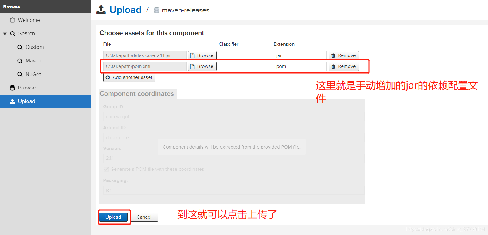

---
kind:
  - Troubleshooting
products:
  - Alauda Container Platform
  - Alauda DevOps
  - Alauda AI
  - Alauda Application Services
  - Alauda Service Mesh
  - Alauda Developer Portal
ProductsVersion:
  - 4.1.0,4.2.x
---
<!-- A type of document that involves encountering a fault, diagnosing it, performing root cause analysis, and providing solutions. -->

# 如何上传本地依赖到nexus

## 环境信息 适用版本：通用

## Cause

## Resolution
- 登录nexus后在upload页签选择maven-releases，上传本地jar及其pom文件

## [workaround]

## [Related Information]
**Screenshots**

- Environment: 通用
- maven-releases
- pom
- jar
- Component: nexus
- Page ID: 144902496
- Original Title: 如何上传本地依赖到nexus
