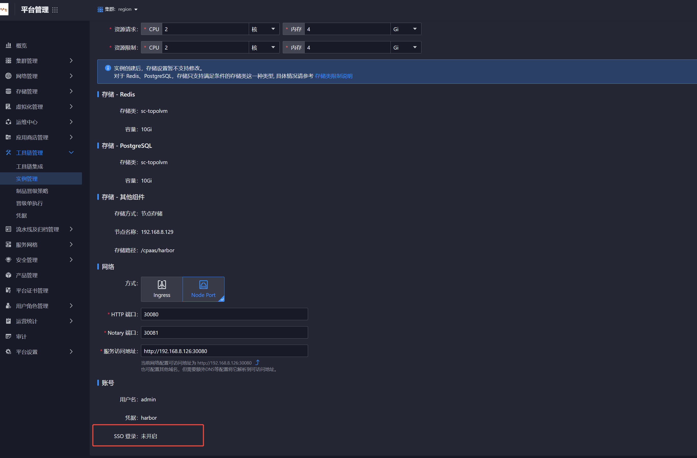

---
kind:
  - Troubleshooting
products:
  - Alauda Container Platform
  - Alauda DevOps
  - Alauda AI
  - Alauda Application Services
  - Alauda Service Mesh
  - Alauda Developer Portal
ProductsVersion:
  - 4.1.0,4.2.x
---
<!-- A type of document that involves encountering a fault, diagnosing it, performing root cause analysis, and providing solutions. -->

# harbor、nexus对接统一用户

需要手动创建harbor用户

## Cause
- 平台不支持直接对接AD/钉钉等外部用户系统

## Resolution
- 部署harbor时开启SSO对接平台用户
- 通过原生功能自行对接LDAP/OIDC(需走需求流程)

## [workaround]

## [Related Information]
**Screenshots**

- Environment: harbor 3.18.1
- sso配置
- ldap
- oidc
- harbor
- nexus
- Component: nexus
- Page ID: 268534611
- Original Title: Devops-harbor、nexus对接统一用户
