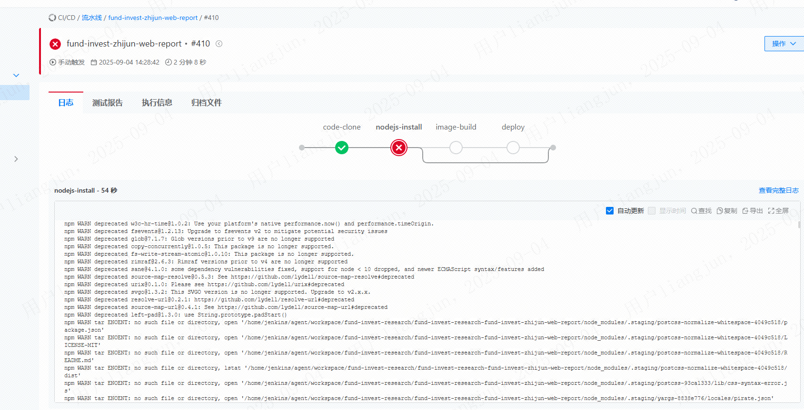
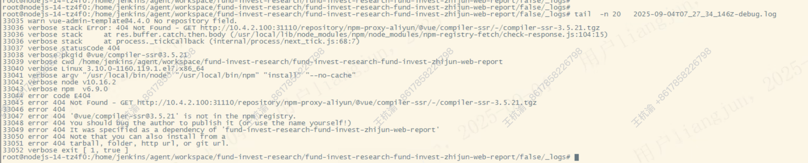

---
kind:
  - Troubleshooting
products:
  - Alauda Container Platform
  - Alauda DevOps
  - Alauda AI
  - Alauda Application Services
  - Alauda Service Mesh
  - Alauda Developer Portal
ProductsVersion:
  - 4.1.0,4.2.x
---
<!-- A type of document that involves encountering a fault, diagnosing it, performing root cause analysis, and providing solutions. -->

# maven构建阶段偶现报错缺少依赖包问题

编译阶段打包偶现失败报错缺少依赖包

## Cause
- nexus代理库指向的外网maven仓库使用了CDN跳转，而防火墙仅开通了部分目标范围域名/ip地址端口

## Resolution
- 调整防火墙策略允许nexus节点访问外网仓库所有可能的CDN节点和IP地址

## [workaround]

## [Related Information]
**Screenshots**

- Environment: 通用
- nexus仓库配置
- 外网maven仓库地址
- 防火墙规则
- CDN配置
- Component: nexus
- Page ID: 342670813
- Original Title: Devops-maven构建阶段偶现报错缺少依赖包问题
