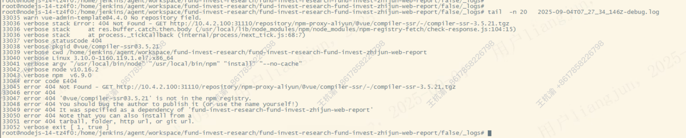

---kind:   - Troubleshootingproducts:    - Alauda Container Platform   - Alauda DevOps   - Alauda AI   - Alauda Application Services   - Alauda Service Mesh   - Alauda Developer PortalProductsVersion:   - 4.1.0,4.2.x---<!-- A type of document that involves encountering a fault, diag...it, performing root cause analysis, and providing solutions. --># 编译阶段打包偶现失败报错缺少依赖包编译阶段打包偶现失败报错缺少依赖包## Cause- nexus代理库指向的外网maven仓库使用了CDN跳转- 防火墙仅开通了特定目标范围域名/ip地址端口## Resolution- 检查并扩大防火墙允许的CDN相关域名/IP地址范围- 确保nexus节点能访问外网maven仓库所有可能的CDN节点## [workaround]- 临时关闭防火墙测试验证- 在nexus配置中直接使用稳定的非CDN仓库地址## [Related Information]**Screenshots**- nexus- maven- 代理库配置- 防火墙规则- CDN- Component: nexus- Page ID: 342670813- Original Title: Devops-编译阶段打包偶现失败报错缺少依赖包