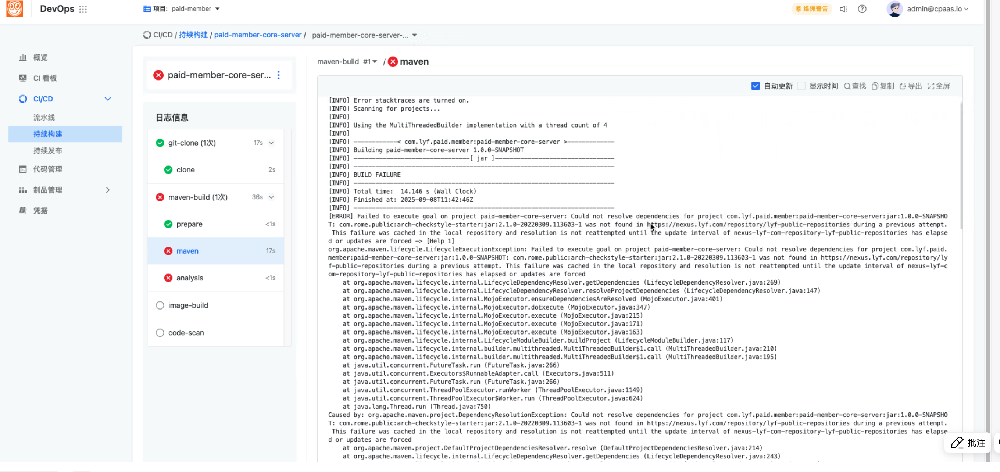
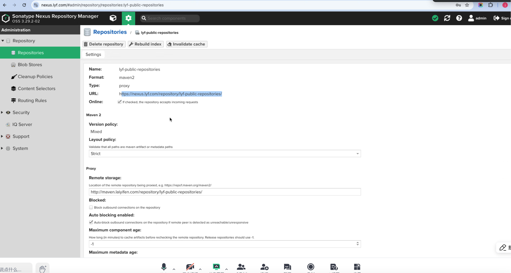

---
kind:
  - Troubleshooting
products:
  - Alauda Container Platform
  - Alauda DevOps
  - Alauda AI
  - Alauda Application Services
  - Alauda Service Mesh
  - Alauda Developer Portal
ProductsVersion:
  - 4.1.0,4.2.x
---
<!-- A type of document that involves encountering a fault, diagnosing it, performing root cause analysis, and providing solutions. -->

# maven构建缺少依赖包

maven构建阶段失败，报错提示缺少依赖包（如paid-member-core-server、arch-checkstryle-starter） 报错信息包含'could not resolve'、'was not found'

## Cause
- nexus仓库中缺少所需依赖包
- maven配置的依赖仓库选择不正确

## Resolution
- 检查group库是否存在缺失依赖包
- 检查proxy代理库成员（如maven.laiyifen.com/lyf-public-repo）是否存在依赖包
- 确认依赖包存在后排查nexus间网络问题
- 切换正确的代理仓库配置

## [workaround]

## [Related Information]
**Screenshots**

- Environment: 通用
- nexus仓库
- group库
- proxy库
- maven.laiyifen.com/lyf-public-repo
- Component: nexus
- Page ID: 345538844
- Original Title: Devops-maven构建缺少依赖包
