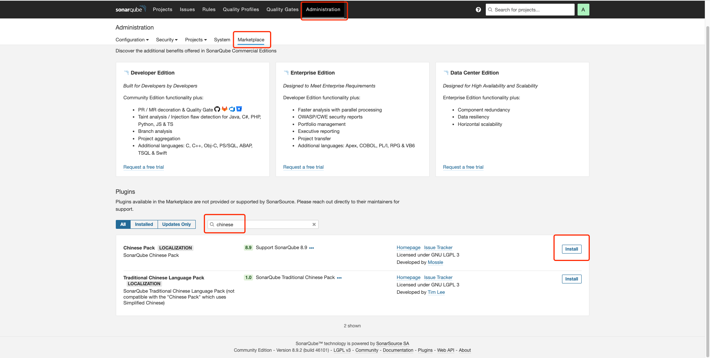
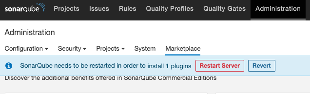
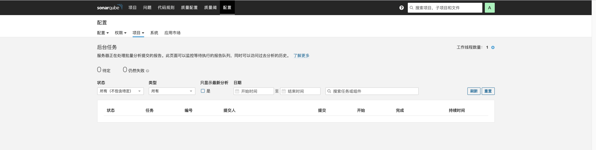

---
kind:
  - Troubleshooting
products:
  - Alauda Container Platform
  - Alauda DevOps
  - Alauda AI
  - Alauda Application Services
  - Alauda Service Mesh
  - Alauda Developer Portal
ProductsVersion:
  - 4.1.0,4.2.x
---
<!-- A type of document that involves encountering a fault, diagnosing it, performing root cause analysis, and providing solutions. -->

# 3.8.1

Pod重启后中文插件被删除

## Cause
- SonarQube产品设计不支持插件安装与升级

## Resolution
- 通过Administration → Marketplace搜索chinese插件并安装，执行页面重启

## [workaround]
- 避免触发Pod重启操作

## [Related Information]
**Screenshots**

- Environment: TKE 3.8.1，SonarQube Pod需可连通外网与访问GitHub
- Administration
- Marketplace
- chinese插件
- Component: sonarqube
- Page ID: 120115539
- Original Title: 3.8.1-sonarqube汉化方式
