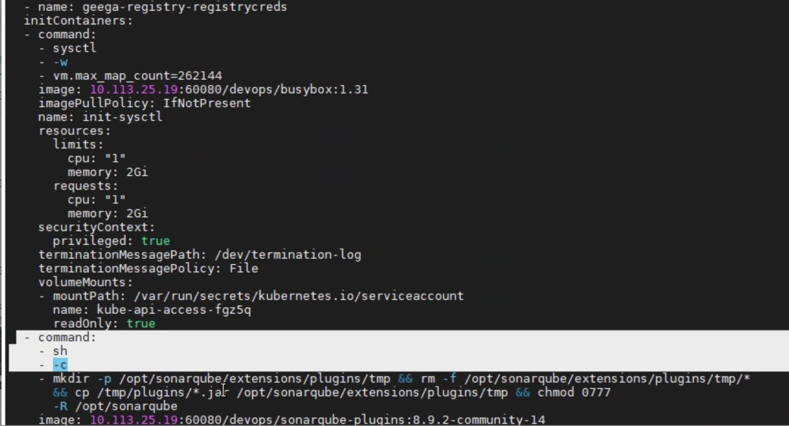
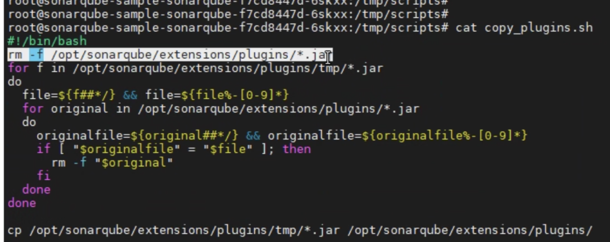

---
kind:
  - Troubleshooting
products:
  - Alauda Container Platform
  - Alauda DevOps
  - Alauda AI
  - Alauda Application Services
  - Alauda Service Mesh
  - Alauda Developer Portal
ProductsVersion:
  - 4.1.0,4.2.x
---
<!-- A type of document that involves encountering a fault, diagnosing it, performing root cause analysis, and providing solutions. -->

# sonarqube插件被还原

安装的插件在OOM重启后消失 升级过的插件版本被回退

## Cause
- init容器将镜像/tmp目录的jar包覆盖数据目录
- 主容器启动前执行脚本强制还原插件文件

## Resolution
- 修改初始化容器逻辑避免覆盖已有插件
- 调整启动脚本保留用户安装的插件

## [workaround]
- 通过页面执行server restart代替pod重建操作

## [Related Information]
**Screenshots**

- Environment: TKE 3.6
- /tmp/
- init容器
- sonar数据目录
- 插件jar包
- Component: sonarqube
- Page ID: 133076147
- Original Title: sonarqube插件被还原
