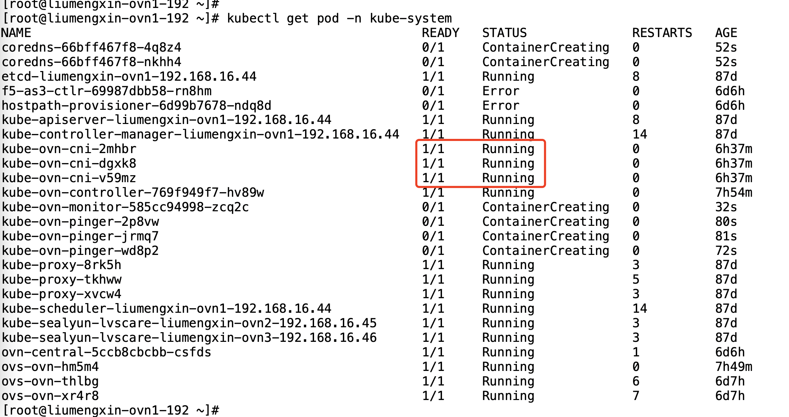

---
kind:
  - Troubleshooting
products:
  - Alauda Container Platform
  - Alauda DevOps
  - Alauda AI
  - Alauda Application Services
  - Alauda Service Mesh
  - Alauda Developer Portal
ProductsVersion:
  - 4.1.0,4.2.x
---
<!-- A type of document that involves encountering a fault, diagnosing it, performing root cause analysis, and providing solutions. -->

# sonarqube扫描整个项目代码仓库OOM

执行到sonar步骤时提示OOM

## Cause
- 代码仓库文件太多导致内存不足

## Resolution
- 调整构建节点base节点的tools容器配置，增加内存资源

## [workaround]

## [Related Information]
**Screenshots**

- Environment: 通用
- jenkins流水线
- sonarqube
- 构建节点tools容器
- Component: sonarqube
- Page ID: 163078217
- Original Title: sonarqube扫描整个项目代码仓库OOM
