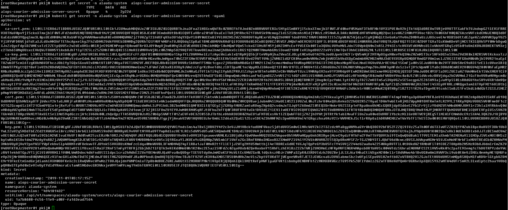

---
kind:
  - Troubleshooting
products:
  - Alauda Container Platform
  - Alauda DevOps
  - Alauda AI
  - Alauda Application Services
  - Alauda Service Mesh
  - Alauda Developer Portal
ProductsVersion:
  - 4.1.0,4.2.x
---
<!-- A type of document that involves encountering a fault, diagnosing it, performing root cause analysis, and providing solutions. -->

# 2.6

courier组件无法正常运行

## Cause
- courier组件对应的secret资源被删除

## Resolution
- 手动创建对应的secret资源，证书位置留空，重启courier组件

## [workaround]

## [Related Information]
**Screenshots**
手动创建对应的secret资源，参照证书位置留空，重启courier组件后secret恢复，courier组件运行正常。
- Environment: 2.6
- courier组件
- secret资源
- Component: (待归类)
- Page ID: 101652346
- Original Title: 2.6-容器平台-courier组件对应secret丢失
