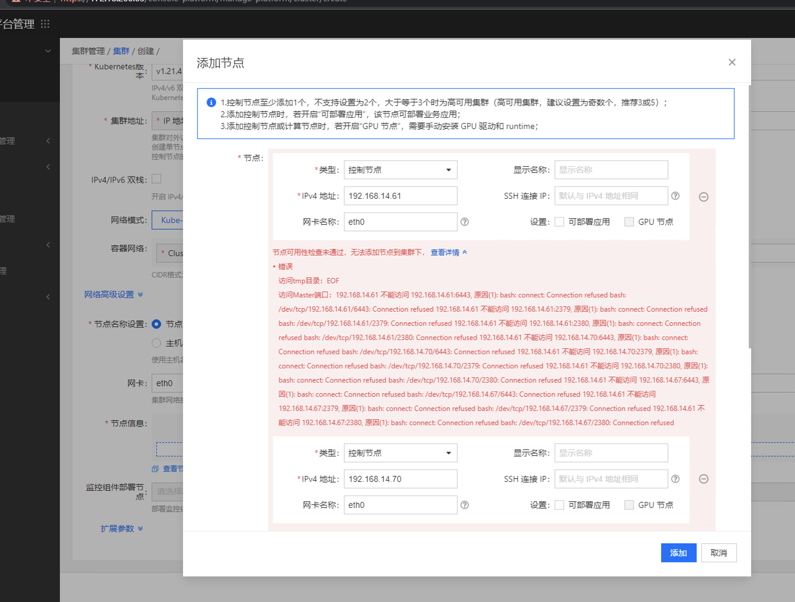
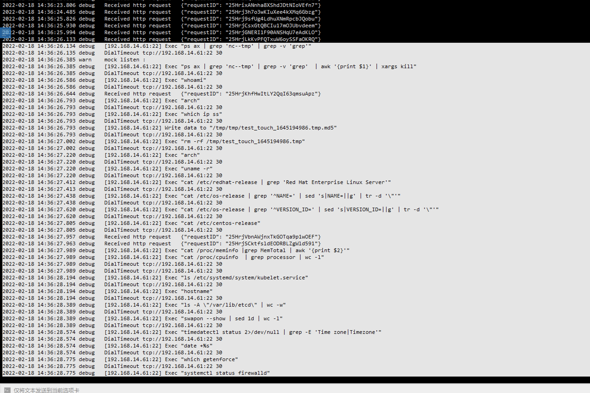

---
kind:
  - Troubleshooting
products:
  - Alauda Container Platform
  - Alauda DevOps
  - Alauda AI
  - Alauda Application Services
  - Alauda Service Mesh
  - Alauda Developer Portal
ProductsVersion:
  - 4.1.0,4.2.x
---
<!-- A type of document that involves encountering a fault, diagnosing it, performing root cause analysis, and providing solutions. -->

# 创建业务集群节点检测不过

节点检测失败报tmp EOF错误 端口检测不通过

## Cause
- 业务集群节点sftp服务未开启

## Resolution
- 将正常节点的/usr/libexec/openssh/sftp-server复制到异常节点
- 开启sftp服务

## [workaround]

## [Related Information]
**Screenshots**

- Environment: 3.6.2
- sftp服务
- tke-platform-api
- /usr/libexec/openssh/sftp-server
- Component: (待归类)
- Page ID: 108106609
- Original Title: 创建业务集群节点检测不过
