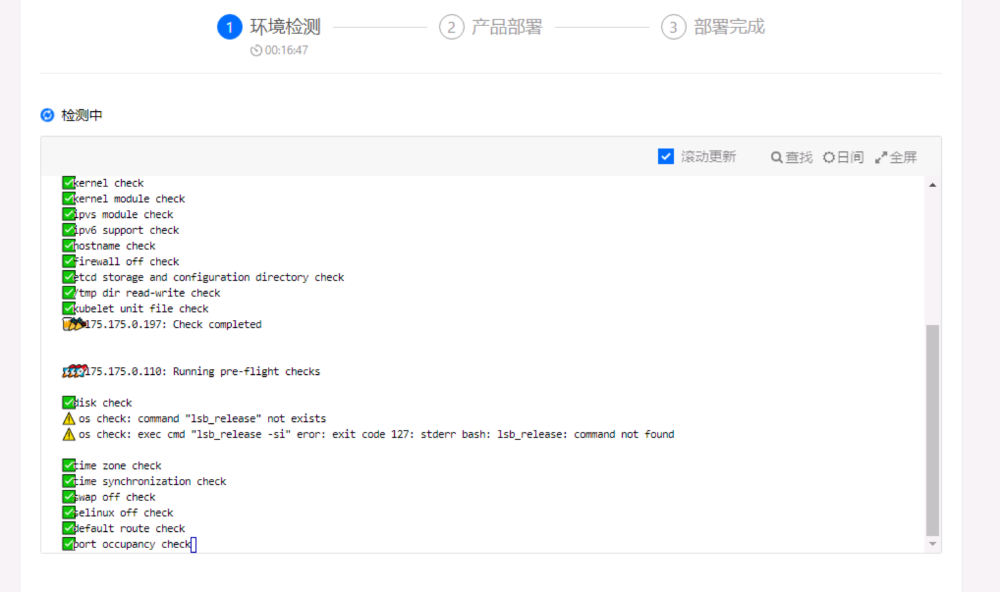
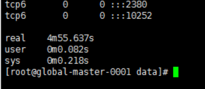

---
kind:
  - Troubleshooting
products:
  - Alauda Container Platform
  - Alauda DevOps
  - Alauda AI
  - Alauda Application Services
  - Alauda Service Mesh
  - Alauda Developer Portal
ProductsVersion:
  - 4.1.0,4.2.x
---
<!-- A type of document that involves encountering a fault, diagnosing it, performing root cause analysis, and providing solutions. -->

# 3.4.2

部署平台一直卡在端口检查阶段 执行netstat和ss命令查看主机端口时命令长时间无返回（约5分钟）

## Cause
- 客户虚机模板存在问题

## Resolution
- 重启并更换主机模板后重新部署

## [workaround]

## [Related Information]
**Screenshots**

- Environment: 3.4.2
- 端口检查机制
- installer日志
- netstat命令
- ss命令
- Component: (待归类)
- Page ID: 108108277
- Original Title: 3.4.2-容器平台-产品生命周期管理-部署平台一直卡在端口检查
