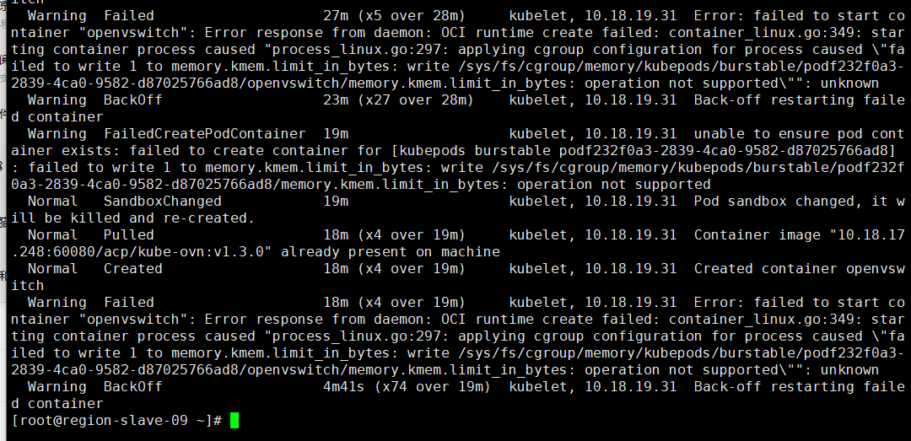
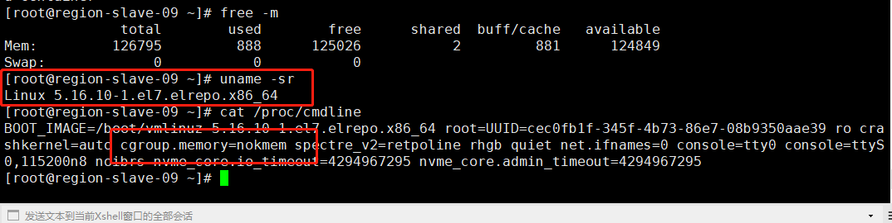

---
kind:
  - Troubleshooting
products:
  - Alauda Container Platform
  - Alauda DevOps
  - Alauda AI
  - Alauda Application Services
  - Alauda Service Mesh
  - Alauda Developer Portal
ProductsVersion:
  - 4.1.0,4.2.x
---
<!-- A type of document that involves encountering a fault, diagnosing it, performing root cause analysis, and providing solutions. -->

# 3.0.5

新增节点调度pod无法启动，报错'failed to set up sandbox container' 计算节点网络插件pod运行异常

## Cause
- 主机内核版本为5.16.10，不满足操作系统内核要求

## Resolution
- 调整内核版本到3.10.0-1062

## [workaround]

## [Related Information]
**Screenshots**

- Environment: 3.0.5
- 内核版本
- Component: (待归类)
- Page ID: 108108348
- Original Title: 3.0.5-容器平台-产品生命周期管理-新增的计算节点调度上去的pod无法启动
