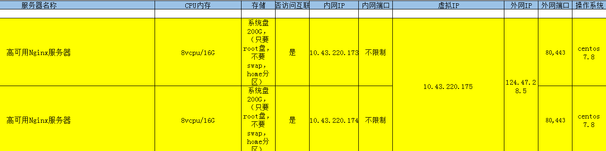
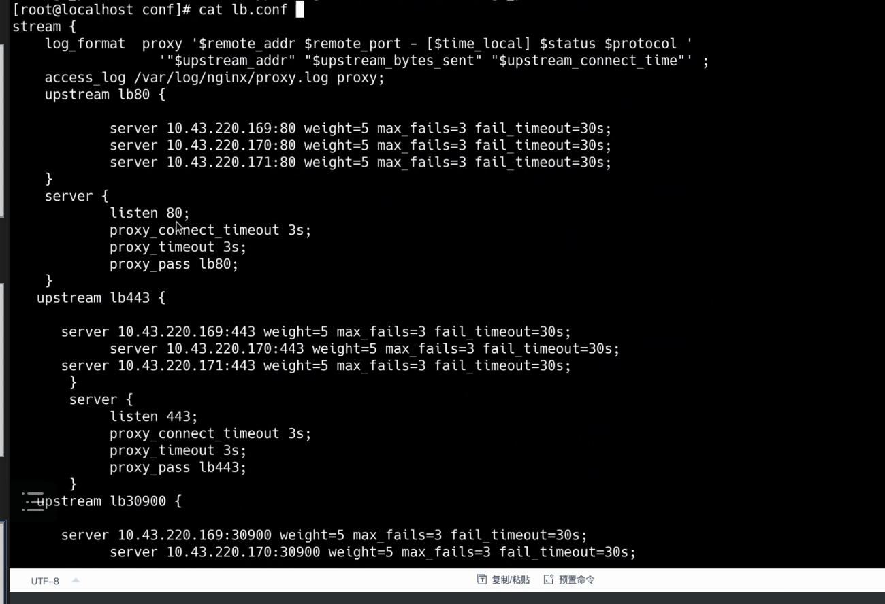

---
kind:
  - Troubleshooting
products:
  - Alauda Container Platform
  - Alauda DevOps
  - Alauda AI
  - Alauda Application Services
  - Alauda Service Mesh
  - Alauda Developer Portal
ProductsVersion:
  - 4.1.0,4.2.x
---
<!-- A type of document that involves encountering a fault, diagnosing it, performing root cause analysis, and providing solutions. -->

# 3.4.2

TKE页面访问平台管理-集群页面显示加载错误 重新加载后3秒左右报错

## Cause
- nginx配置中proxy_connect_timeout和proxy_timeout均为3s

## Resolution
- 调整nginx配置文件内proxy_connect_timeout和proxy_timeout配置为60s

## [workaround]

## [Related Information]
**Screenshots**

- Environment: TKE 3.4.2 高可用nginx虚拟VIP架构
- proxy_connect_timeout
- proxy_timeout
- nginx
- VIP
- Component: (待归类)
- Page ID: 112044542
- Original Title: 3.4.2-容器平台-查看global集群信息报错加载错误
