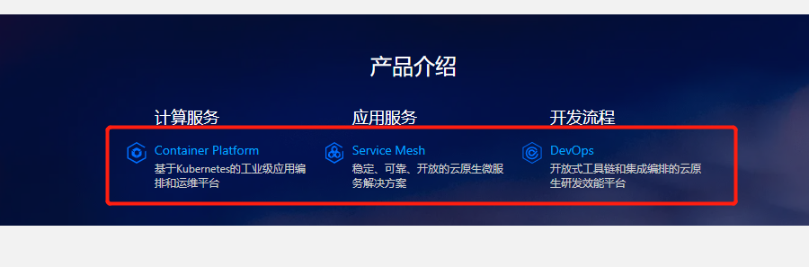

---
kind:
  - Troubleshooting
products:
  - Alauda Container Platform
  - Alauda DevOps
  - Alauda AI
  - Alauda Application Services
  - Alauda Service Mesh
  - Alauda Developer Portal
ProductsVersion:
  - 4.1.0,4.2.x
---
<!-- A type of document that involves encountering a fault, diagnosing it, performing root cause analysis, and providing solutions. -->

# 平台logo替换

portal页面卡片logo无法更换 portal页面产品介绍logo无法更换 平台管理-产品管理处logo无法更换

## Cause
- 特定logo位置未开放前端修改功能
- 需要直接修改Kubernetes资源配置

## Resolution
- 修改global集群ProductConfig(acp/asm/devops)配置文件
- 修改global集群ProductDocsEntry(product-docs-entry)配置文件
- 修改global集群ProductConfig(base)配置文件
- 修改global集群productbase(base)的metadata.annotations.[cpaas.io/product-logo]字段
- 所有logo需转换为base64格式
- 3.4.x版本需添加skip-sync注解(productbase除外)

## [workaround]

## [Related Information]
**Screenshots**

- Environment: TKE 3.4.x, 3.6.x
- ProductConfig
- ProductDocsEntry
- productbase
- acp
- asm
- devops
- base
- metadata.annotations.cpaas.io/product-logo
- Component: (待归类)
- Page ID: 112053693
- Original Title: 平台logo替换
