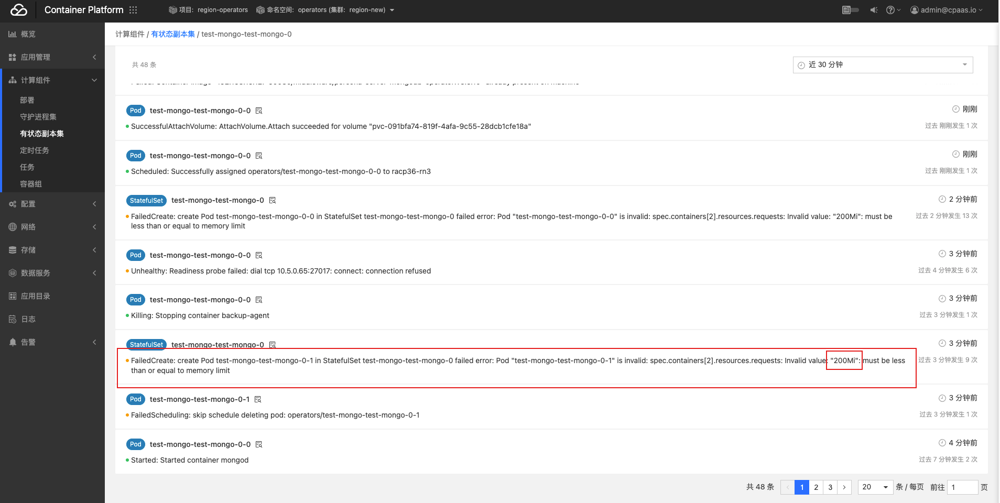
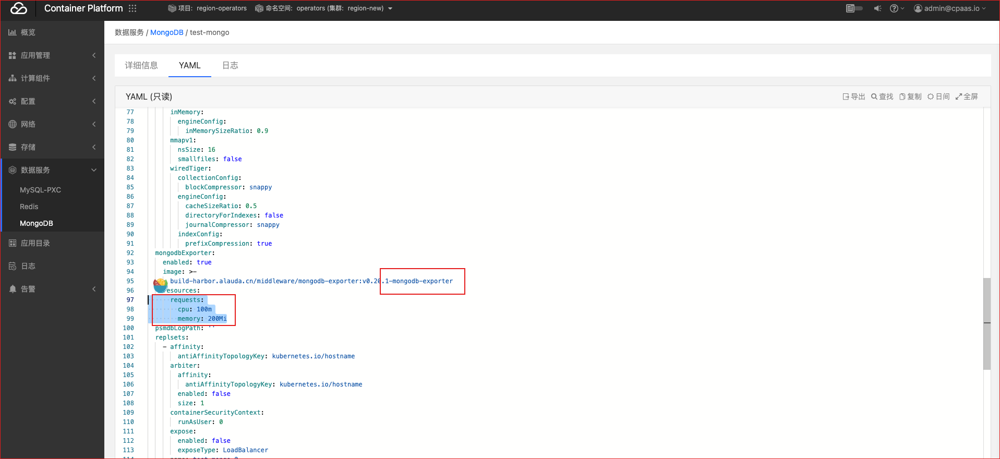
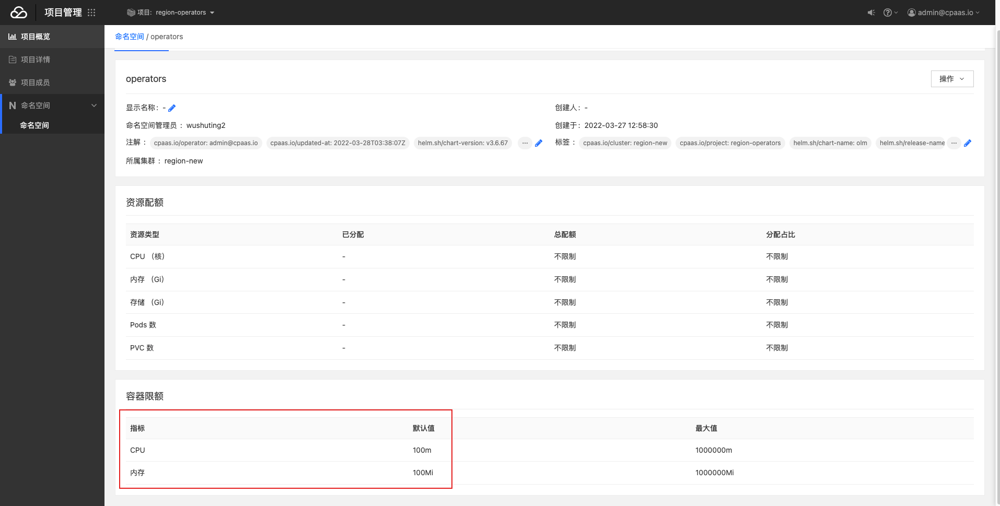
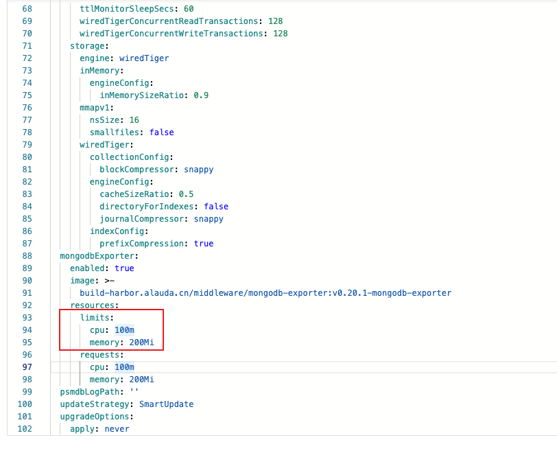

---
kind:
  - Troubleshooting
products:
  - Alauda Container Platform
  - Alauda DevOps
  - Alauda AI
  - Alauda Application Services
  - Alauda Service Mesh
  - Alauda Developer Portal
ProductsVersion:
  - 4.1.0,4.2.x
---
<!-- A type of document that involves encountering a fault, diagnosing it, performing root cause analysis, and providing solutions. -->

# 平台部署的mongo集群无法启动

界面卡在部署中 有状态副本集无容器组 事件显示资源问题报错

## Cause
- mongo-exporter资源限制未配置limits
- 命名空间默认limits导致requests超过限制

## Resolution
- 修改yaml手动补充mysql-exporter资源限制(requests/limits)

## [workaround]

## [Related Information]
**Screenshots**

- Environment: 3.6.2
- mongo-exporter
- resource.requests
- resource.limits
- Component: (待归类)
- Page ID: 112062039
- Original Title: 平台部署的mongo集群无法启动
