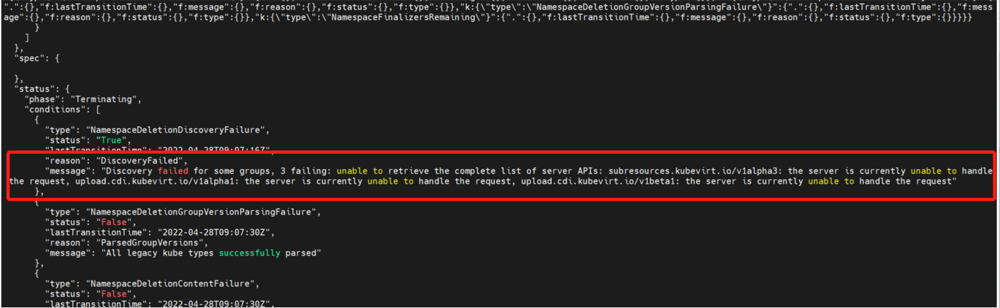
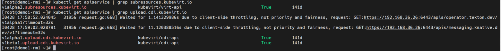

---
kind:
  - Troubleshooting
products:
  - Alauda Container Platform
  - Alauda DevOps
  - Alauda AI
  - Alauda Application Services
  - Alauda Service Mesh
  - Alauda Developer Portal
ProductsVersion:
  - 4.1.0,4.2.x
---
<!-- A type of document that involves encountering a fault, diagnosing it, performing root cause analysis, and providing solutions. -->

# 命名空间删除失败，处于Terminating状态。

在UI界面删除命名空间卡住 命名空间处于Terminating状态

## Cause
- 存在未删除的apiservice资源

## Resolution
- 使用kubectl describe ns xxx | grep message查看事件信息
- 通过kubectl get apiservice | grep xxx查找关联的apiservice资源
- 执行kubectl delete apiservice xxx删除卡住的资源

## [workaround]

## [Related Information]
**Screenshots**

- kubectl describe ns
- kubectl get apiservice
- kubectl delete apiservice
- apiservice资源
- Component: (待归类)
- Page ID: 115516170
- Original Title: 命名空间删除失败，处于Terminating状态。
