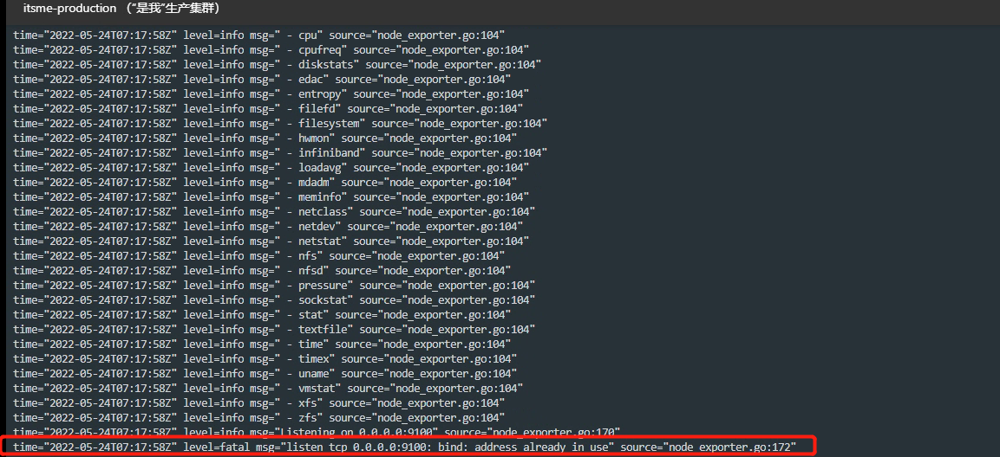

---
kind:
  - Troubleshooting
products:
  - Alauda Container Platform
  - Alauda DevOps
  - Alauda AI
  - Alauda Application Services
  - Alauda Service Mesh
  - Alauda Developer Portal
ProductsVersion:
  - 4.1.0,4.2.x
---
<!-- A type of document that involves encountering a fault, diagnosing it, performing root cause analysis, and providing solutions. -->

# kube

CrashLoopBackOff Port 9100 already in use error in logs

## Cause
- Port 9100 is occupied by another process

## Resolution
- Check 9100 port usage on the node with `lsof -i:9100` or `netstat -tuln | grep 9100`, terminate conflicting process after customer confirmation

## [workaround]

## [Related Information]
**Screenshots**

- Environment: 3.0.1
- 9100
- Component: (待归类)
- Page ID: 115523092
- Original Title: kube-prometheus-exporter-node服务启动失败
