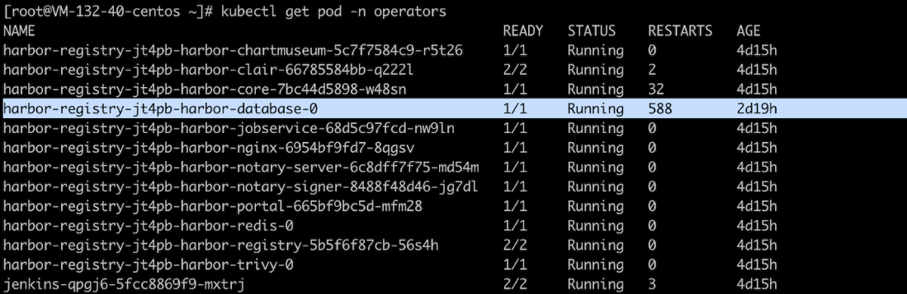

---
kind:
  - Troubleshooting
products:
  - Alauda Container Platform
  - Alauda DevOps
  - Alauda AI
  - Alauda Application Services
  - Alauda Service Mesh
  - Alauda Developer Portal
ProductsVersion:
  - 4.1.0,4.2.x
---
<!-- A type of document that involves encountering a fault, diagnosing it, performing root cause analysis, and providing solutions. -->

# databases服务频繁触发重启

服务频繁触发重启 退出代码为137 健康检查失败

## Cause
- 健康检查超时时间设置过短导致探测失败

## Resolution
- 修改StatefulSet的readinessProbe.timeoutSeconds配置：
kubectl edit sts -n命名空间 harbor-databases
将timeoutSeconds从1调整为10

## [workaround]

## [Related Information]
**Screenshots**

- Environment: 3.6.2
- harbor-databases
- StatefulSet
- readinessProbe
- timeoutSeconds
- 命名空间
- Component: (待归类)
- Page ID: 115525688
- Original Title: Devops-harbor-databases服务频繁触发重启
