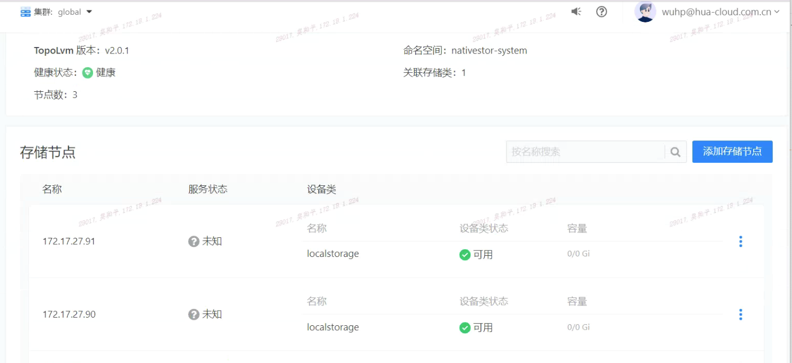
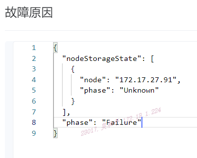
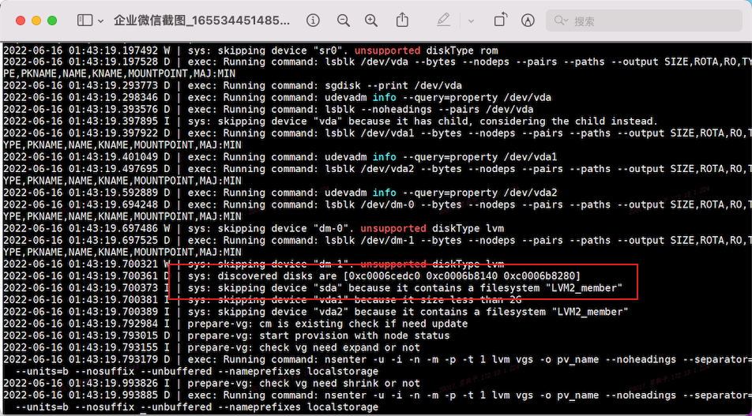
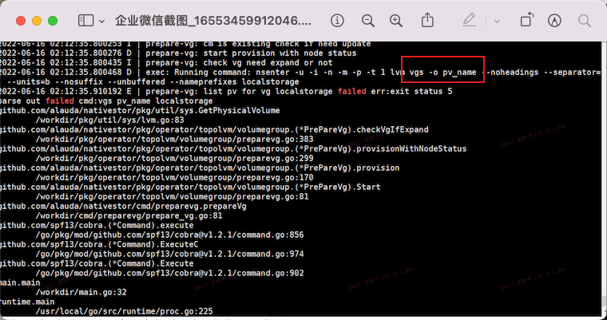
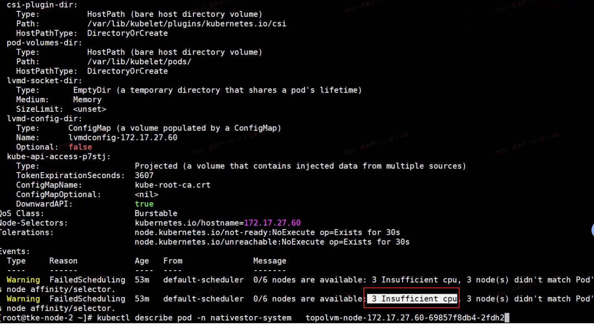
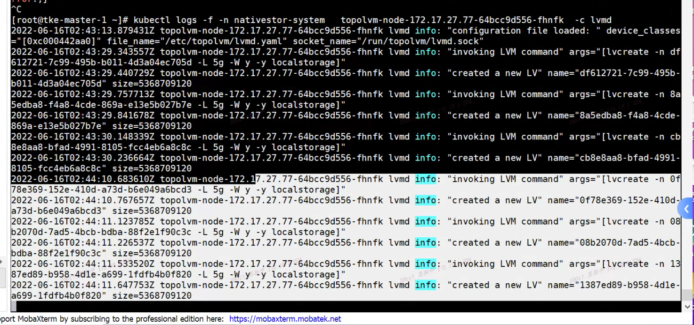
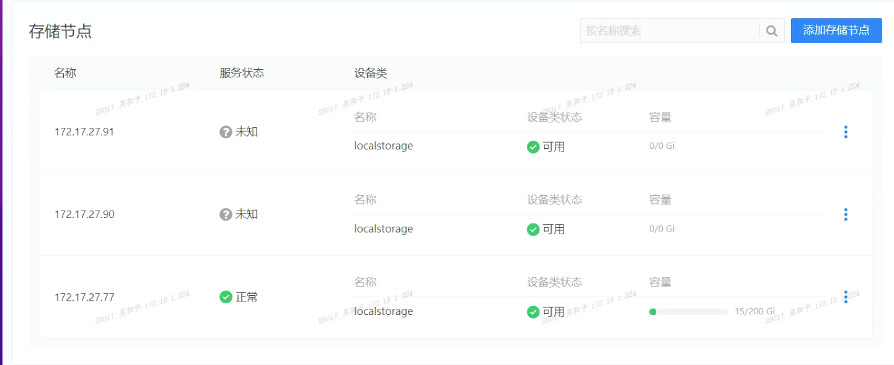

---
kind:
  - Troubleshooting
products:
  - Alauda Container Platform
  - Alauda DevOps
  - Alauda AI
  - Alauda Application Services
  - Alauda Service Mesh
  - Alauda Developer Portal
ProductsVersion:
  - 4.1.0,4.2.x
---
<!-- A type of document that involves encountering a fault, diagnosing it, performing root cause analysis, and providing solutions. -->

# 本地存储添加存储节点界面状态显示未知

界面显示存储节点状态未知 集群状态告警 topolvm-prepare日志显示磁盘存在文件系统

## Cause
- 使用的磁盘存在文件系统
- 节点CPU资源不足

## Resolution
- 擦除磁盘分区并清除文件系统
- 补充节点CPU资源

## [workaround]

## [Related Information]
**Screenshots**

- Environment: v3.8 with topolvm
- topolvm-prepare
- topolvm-node
- lvmd
- vgs
- LVM
- Component: (待归类)
- Page ID: 115536902
- Original Title: 本地存储添加存储节点界面状态显示未知
