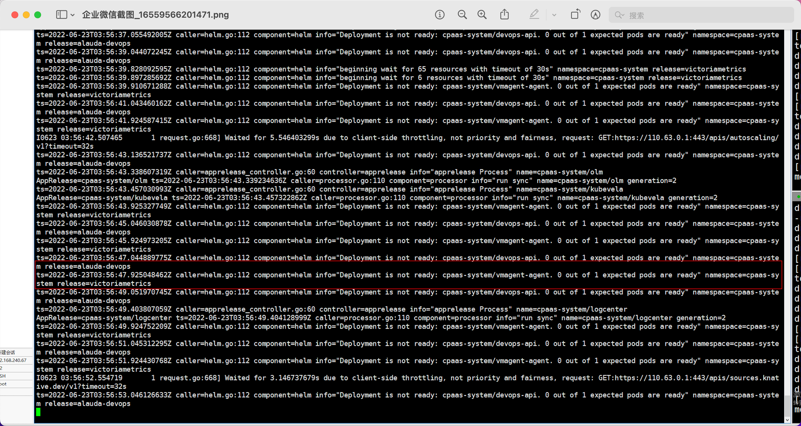
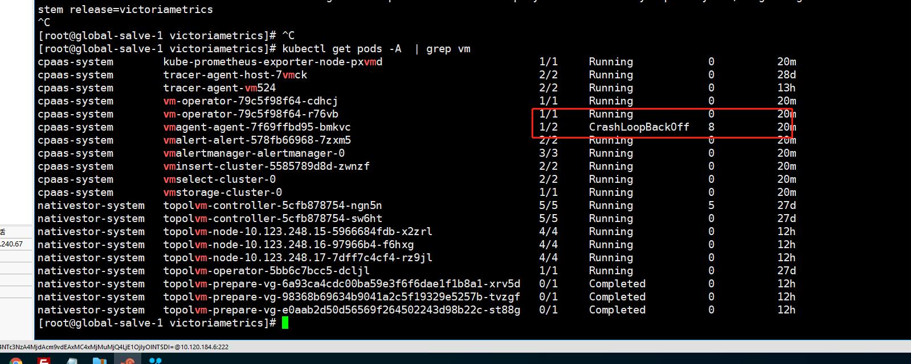
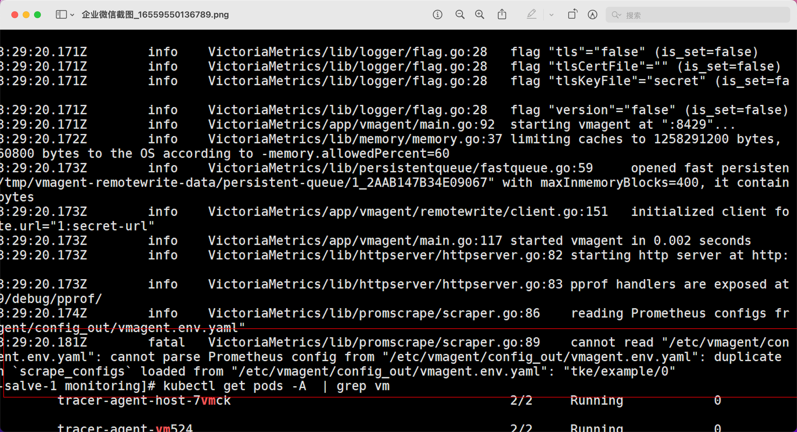
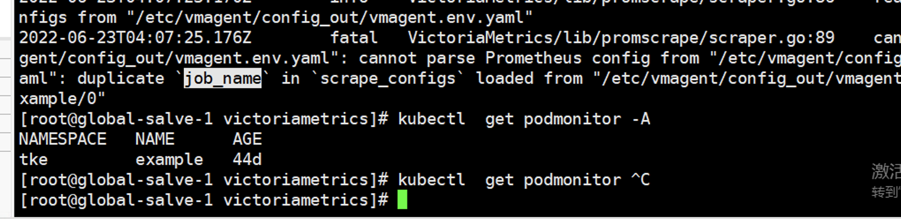
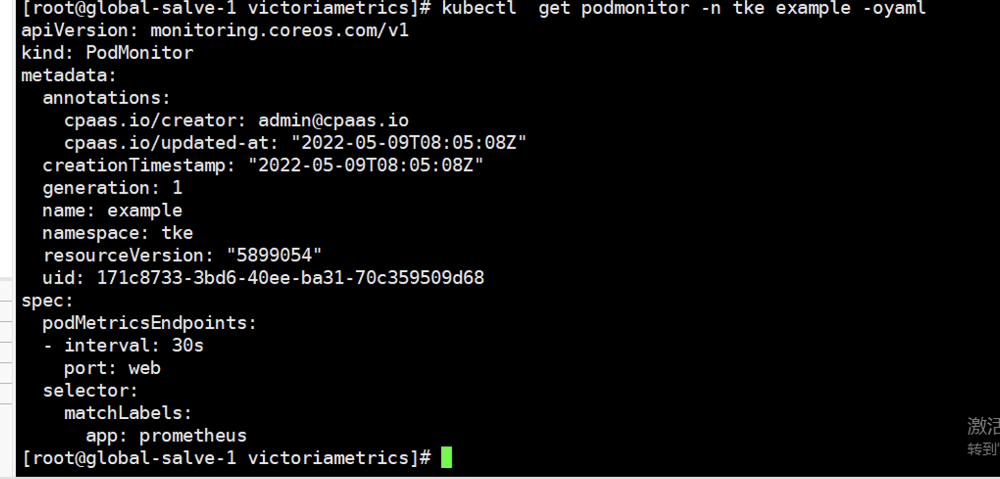
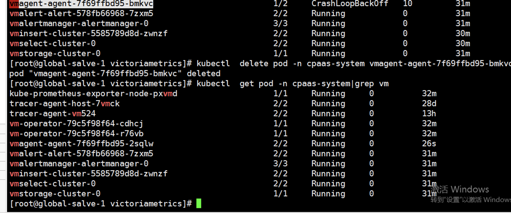
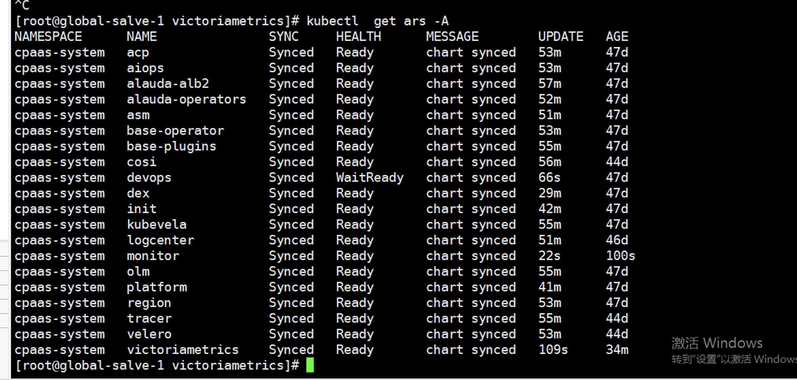

---
kind:
  - Troubleshooting
products:
  - Alauda Container Platform
  - Alauda DevOps
  - Alauda AI
  - Alauda Application Services
  - Alauda Service Mesh
  - Alauda Developer Portal
ProductsVersion:
  - 4.1.0,4.2.x
---
<!-- A type of document that involves encountering a fault, diagnosing it, performing root cause analysis, and providing solutions. -->

# VictorMetrics部署失败

部署chart时拉取超时 vmagent容器未启动 加载数据时检测到重复监控数据项

## Cause
- 存在重复的PodMonitor监控项配置

## Resolution
- 备份并删除重复的podmonitor配置
- 重启vmagent容器

## [workaround]

## [Related Information]
**Screenshots**

- Environment: 3.8
- vmagent
- PodMonitor
- sentry日志
- 监控项配置
- Component: (待归类)
- Page ID: 119080430
- Original Title: VictorMetrics部署失败
