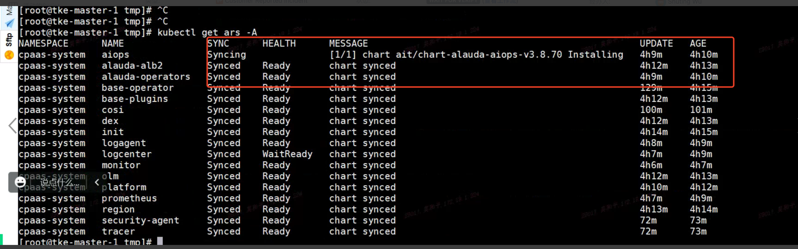
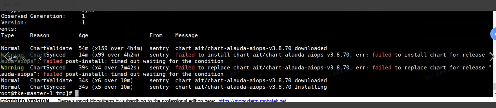

---
kind:
  - Troubleshooting
products:
  - Alauda Container Platform
  - Alauda DevOps
  - Alauda AI
  - Alauda Application Services
  - Alauda Service Mesh
  - Alauda Developer Portal
ProductsVersion:
  - 4.1.0,4.2.x
---
<!-- A type of document that involves encountering a fault, diagnosing it, performing root cause analysis, and providing solutions. -->

# ars资源事件报post

部署页面阻塞在安装TKE组件 ars资源中log-center与aiops异常 wait-plugin job的post-install钩子容器阻塞，日志显示aiops ARS因logcenter ARS未ready而卡住

## Cause
- es 3.8.1的BUG导致es日志报错hardware failed，进而导致logcenter ARS未ready

## Resolution
- 修复es BUG后，logcenter恢复，钩子执行完毕，aiops恢复，平台部署完成

## [workaround]

## [Related Information]
**Screenshots**

- Environment: TKE 3.8
- log-center
- aiops
- es
- wait-plugin job
- post-install钩子
- Component: (待归类)
- Page ID: 119080922
- Original Title: ars资源事件报post-install failed
