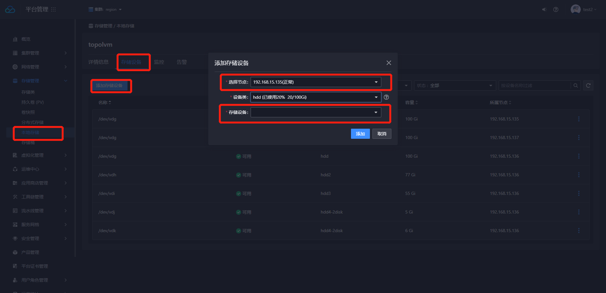

---
kind:
  - Troubleshooting
products:
  - Alauda Container Platform
  - Alauda DevOps
  - Alauda AI
  - Alauda Application Services
  - Alauda Service Mesh
  - Alauda Developer Portal
ProductsVersion:
  - 4.1.0,4.2.x
---
<!-- A type of document that involves encountering a fault, diagnosing it, performing root cause analysis, and providing solutions. -->

# topolvm已创建使用的磁盘存储是否支持扩容动作

JIRA Jira：

## Cause

## Resolution
- 通过平台管理-本地存储-存储设备-添加存储设备-可选择节点与需要扩容的设备类，平台自动识别当前节点裸磁盘，通过磁盘设备选择进行添加
- 观察设备类扩容情况

## [workaround]

## [Related Information]
**Screenshots**

- Environment: 3.8*
- topolvm
- 平台管理
- 本地存储
- 存储设备
- 设备类
- 节点
- 裸磁盘
- Component: (待归类)
- Page ID: 119081403
- Original Title: topolvm已创建使用的磁盘存储是否支持扩容动作
