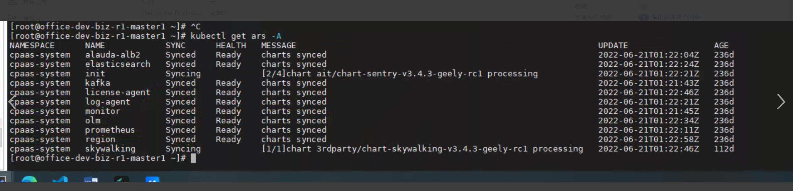

---
kind:
  - Troubleshooting
products:
  - Alauda Container Platform
  - Alauda DevOps
  - Alauda AI
  - Alauda Application Services
  - Alauda Service Mesh
  - Alauda Developer Portal
ProductsVersion:
  - 4.1.0,4.2.x
---
<!-- A type of document that involves encountering a fault, diagnosing it, performing root cause analysis, and providing solutions. -->

# ars资源异常

多个ars资源处于syncing中 sentry logs报cpaas-system:default sa缺少operator.alauda.io资源的list权限

## Cause
- cpaas-system:default sa缺失operator.alauda.io相关ClusterRole权限
- 集群丢失default-sa

## Resolution
- 手动为cpaas-system:default sa创建cluster-admin的ClusterRoleBinding
- 重启sentry组件

## [workaround]

## [Related Information]
**Screenshots**

- Environment: TKE 3.4
- sentry
- cpaas-system:default
- default-sa
- operator.alauda.io
- Component: (待归类)
- Page ID: 119084628
- Original Title: ars资源异常
