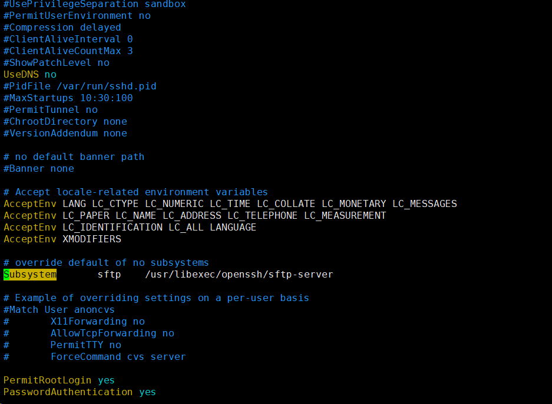

---
kind:
  - Troubleshooting
products:
  - Alauda Container Platform
  - Alauda DevOps
  - Alauda AI
  - Alauda Application Services
  - Alauda Service Mesh
  - Alauda Developer Portal
ProductsVersion:
  - 4.1.0,4.2.x
---
<!-- A type of document that involves encountering a fault, diagnosing it, performing root cause analysis, and providing solutions. -->

# 3.6.3

copy file /opt/ncat/x86_64/ncat to /usr/bin/ncat fail!

## Cause
- sshd配置中Subsystem sftp字段未设置为internal-sftp

## Resolution
- 所有节点修改sshd配置为Subsystem sftp internal-sftp，执行service sshd restart重启服务，清理环境重新部署

## [workaround]

## [Related Information]
**Screenshots**

- Environment: 3.6.3
- sshd
- /opt/ncat/x86_64/ncat
- /usr/bin/ncat
- Subsystem sftp
- Component: (待归类)
- Page ID: 119086022
- Original Title: 3.6.3-基础架构-部署3.6.3环境监测失败
