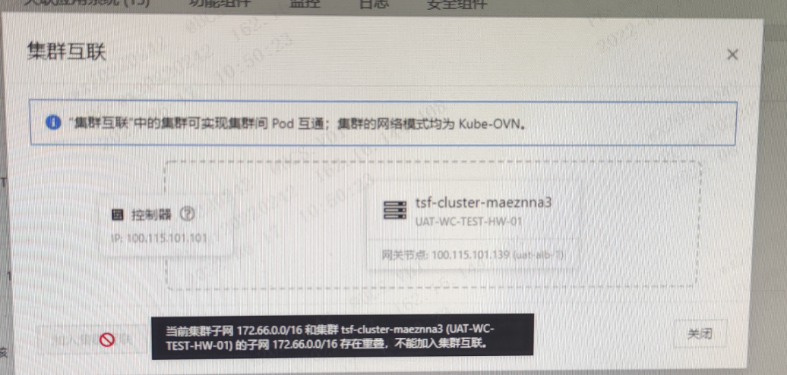
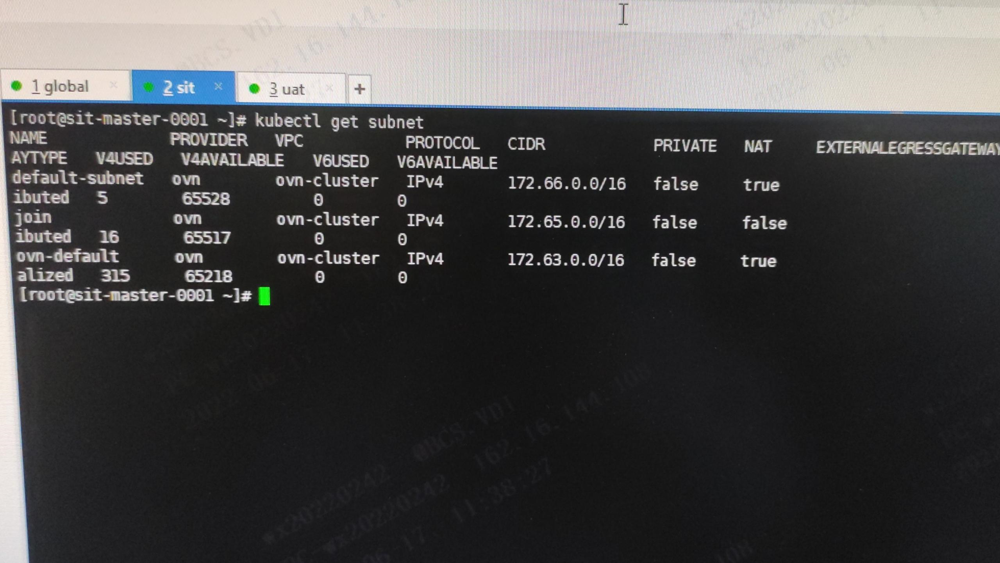
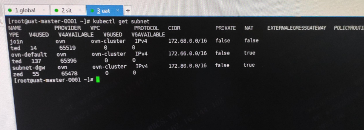

---
kind:
  - Troubleshooting
products:
  - Alauda Container Platform
  - Alauda DevOps
  - Alauda AI
  - Alauda Application Services
  - Alauda Service Mesh
  - Alauda Developer Portal
ProductsVersion:
  - 4.1.0,4.2.x
---
<!-- A type of document that involves encountering a fault, diagnosing it, performing root cause analysis, and providing solutions. -->

# 3.6.2

加入集群互联时报子网重叠错误 显式配置的cluster cidr(172.63.0.0)无冲突但存在其他子网冲突

## Cause
- 两个集群均存在172.66.0.0网段的子网
- 集群互联要求所有子网(包括ovn-default/join子网)不能重叠

## Resolution
- 删除自建的172.66.0.0网段子网
- 重新配置集群互联并部署

## [workaround]

## [Related Information]
**Screenshots**

****
****
- Environment: 3.6.2
- ovn-default子网
- join子网
- cluster cidr配置
- Component: (待归类)
- Page ID: 119086026
- Original Title: 3.6.2-容器平台-加入集群互联后报错子网网段冲突
