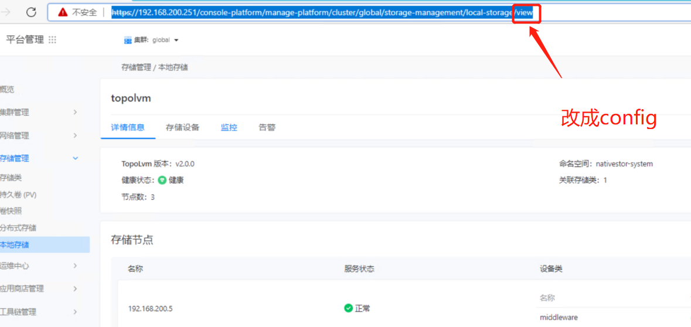

---
kind:
  - Troubleshooting
products:
  - Alauda Container Platform
  - Alauda DevOps
  - Alauda AI
  - Alauda Application Services
  - Alauda Service Mesh
  - Alauda Developer Portal
ProductsVersion:
  - 4.1.0,4.2.x
---
<!-- A type of document that involves encountering a fault, diagnosing it, performing root cause analysis, and providing solutions. -->

# 3.8 topolvm删除后本地存储一直处于加载

本地存储一直处于加载中 接口报错topolvmcluster CRD不存在

## Cause
- 3.8版本存在已知bug

## Resolution
- 升级到3.8.1版本修复该问题

## [workaround]
- 修改URL地址，将访问路径中的view替换为config

## [Related Information]
**Screenshots**

- Environment: 3.8
- topolvmcluster CRD
- /config URL路径
- Component: (待归类)
- Page ID: 119086039
- Original Title: 3.8 topolvm删除后本地存储一直处于加载
