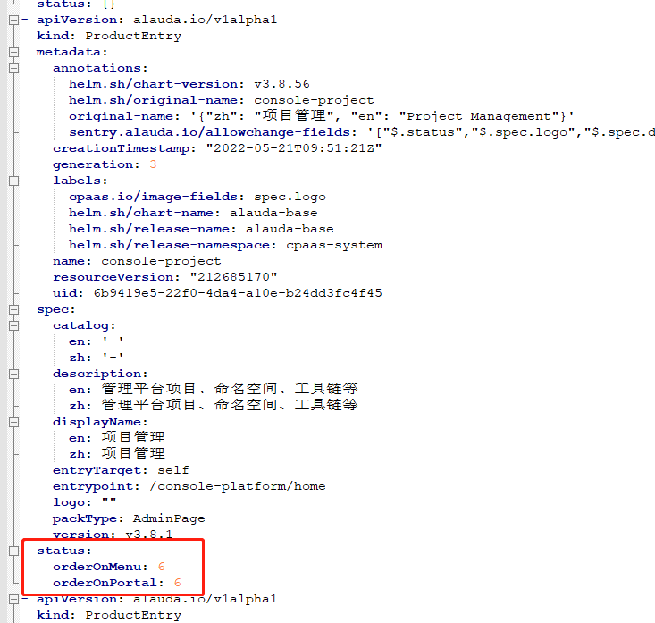

---
kind:
  - Troubleshooting
products:
  - Alauda Container Platform
  - Alauda DevOps
  - Alauda AI
  - Alauda Application Services
  - Alauda Service Mesh
  - Alauda Developer Portal
ProductsVersion:
  - 4.1.0,4.2.x
---
<!-- A type of document that involves encountering a fault, diagnosing it, performing root cause analysis, and providing solutions. -->

# 3.8.1

产品管理点击集成按钮无响应

## Cause
- 手动集成的产品CRD缺少序列号

## Resolution
- 手动添加集成产品prde status缺失的序列号

## [workaround]

## [Related Information]
**Screenshots**

- Environment: 3.8.1
- underload
- icarus
- archon
- naga
- 产品集成CRD
- prde status
- Component: (待归类)
- Page ID: 119086379
- Original Title: 3.8.1-容器平台-产品管理点击集成按钮无响应
