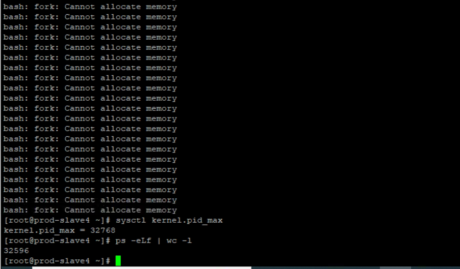

---
kind:
  - Troubleshooting
products:
  - Alauda Container Platform
  - Alauda DevOps
  - Alauda AI
  - Alauda Application Services
  - Alauda Service Mesh
  - Alauda Developer Portal
ProductsVersion:
  - 4.1.0,4.2.x
---
<!-- A type of document that involves encountering a fault, diagnosing it, performing root cause analysis, and providing solutions. -->

# 3.4.2

无法发布容器 执行命令报错'bash fork: cannot allocate memory' 主机进程数接近最大上限

## Cause
- 主机进程数达到内核限制(kernel.pid_max)

## Resolution
- echo "kernel.pid_max=1000000" >> /etc/sysctl.conf
- sysctl -p

## [workaround]

## [Related Information]
**Screenshots**

- Environment: 3.4.2
- kernel.pid_max
- Component: (待归类)
- Page ID: 119086431
- Original Title: 3.4.2-容器平台-无法发布容器
