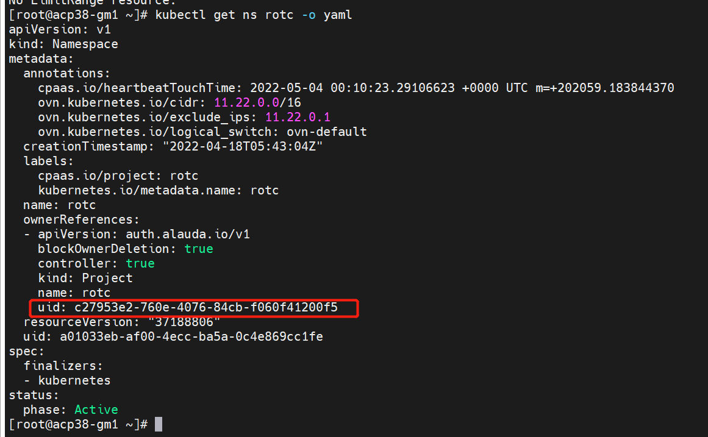
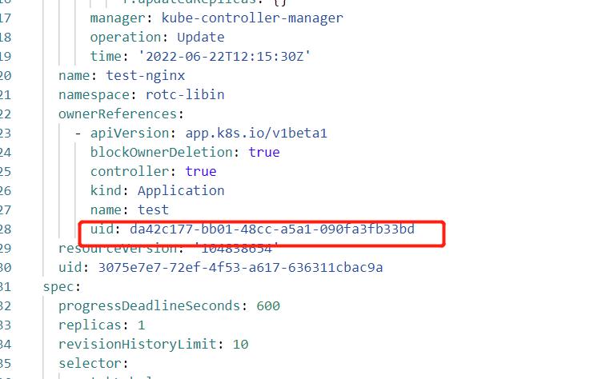

---
kind:
  - Troubleshooting
products:
  - Alauda Container Platform
  - Alauda DevOps
  - Alauda AI
  - Alauda Application Services
  - Alauda Service Mesh
  - Alauda Developer Portal
ProductsVersion:
  - 4.1.0,4.2.x
---
<!-- A type of document that involves encountering a fault, diagnosing it, performing root cause analysis, and providing solutions. -->

# 从别的集群导入yaml创建资源失败

创建完成后提示成功但前端无显示 后端无法查询到资源

## Cause
- 原YAML中namespace的uid与新集群实际uid不一致

## Resolution
- kubectl get ns xxx -o yaml 获取目标namespace uid
- 修改资源yaml中metadata.namespace层级下的uid字段后重新部署

## [workaround]

## [Related Information]
**Screenshots**

- Environment: 所有版本
- namespace的metadata.uid
- Component: (待归类)
- Page ID: 119086863
- Original Title: 从别的集群导入yaml创建资源失败
