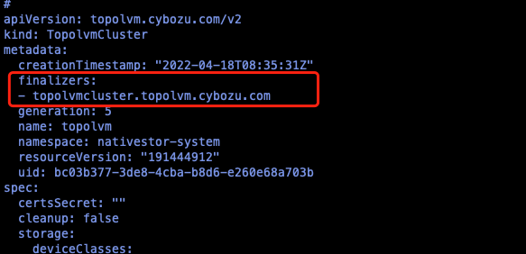

---
kind:
  - Troubleshooting
products:
  - Alauda Container Platform
  - Alauda DevOps
  - Alauda AI
  - Alauda Application Services
  - Alauda Service Mesh
  - Alauda Developer Portal
ProductsVersion:
  - 4.1.0,4.2.x
---
<!-- A type of document that involves encountering a fault, diagnosing it, performing root cause analysis, and providing solutions. -->

# 3.8卸载topolvm

页面隐藏了 topolvm 的卸载按钮 应用市场看不到 topolvm operator 实例

## Cause
- finalizers 字段阻止资源删除
- 残留的 PVC/SC/rawdevices 等存储资源

## Resolution
- kubectl get pvc -A && kubectl get sc -A && 删除相关资源
- kubectl edit topolvmcluster -n xxxx topolvm 删除 finalizers 字段
- 修改 spec.clean: true 等待卸载
- kubectl delete installplans.operators.coreos.com/subscriptions.operators.coreos.com/topolvmcluster
- kubectl delete rawdevices
- lsblk /dev/vdc && dd/wipefs/sgdisk 清理存储设备

## [workaround]

## [Related Information]
**Screenshots**

- Environment: 3.8
- topolvmcluster
- pvc
- sc
- installplans.operators.coreos.com
- subscriptions.operators.coreos.com
- rawdevices
- nativestor-system
- Component: (待归类)
- Page ID: 119087155
- Original Title: 3.8卸载topolvm
